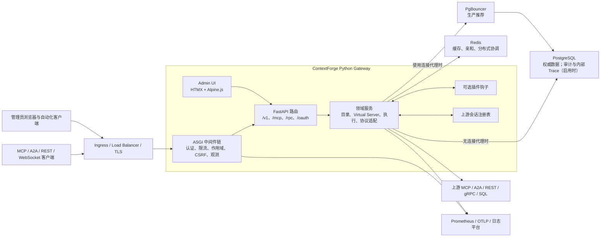
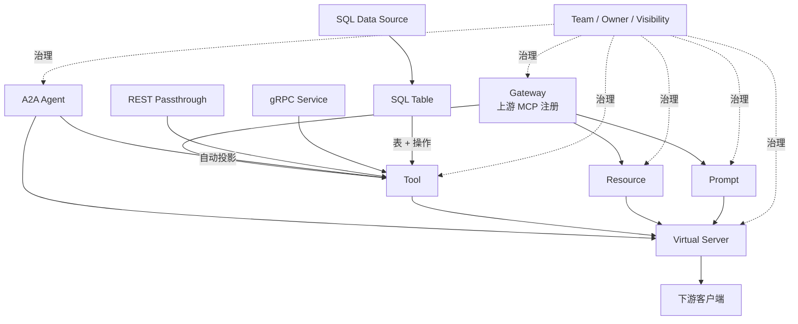
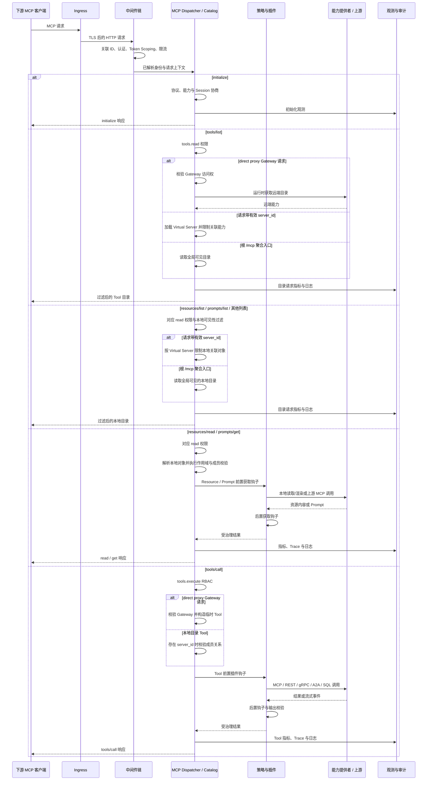
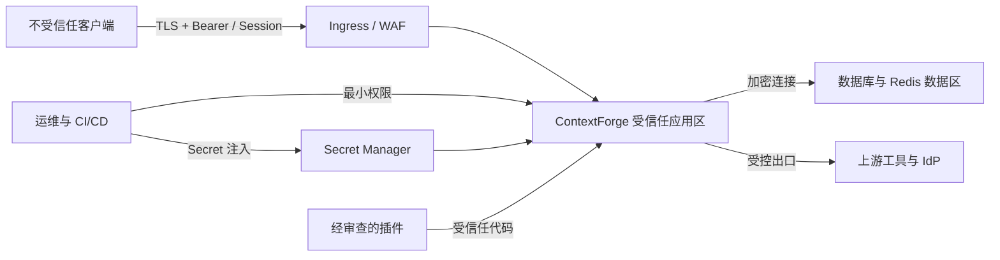
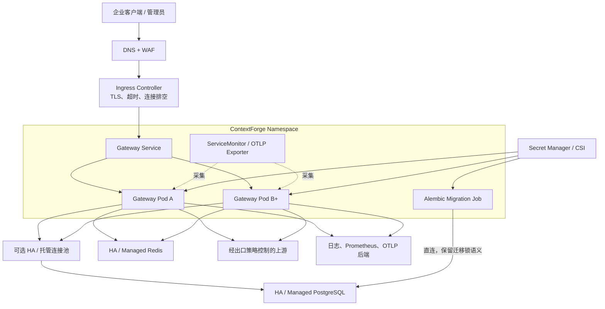

# ContextForge 当前技术方案

## 1. 文档说明

| 项目 | 内容 |
| --- | --- |
| 产品 | ContextForge AI Gateway |
| 包版本 | 1.0.7 |
| Git 基线 | `5f2a3af6` |
| 审计日期 | 2026-08-28 |
| 文档状态 | 当前实现基线与生产落地建议 |
| 主要读者 | 架构师、开发、测试、安全、平台工程与运维团队 |
| 适用范围 | MCP、A2A、REST/gRPC、SQL API 的统一接入、治理、发布与观测 |

本文描述当前代码可以交付的技术方案，并给出生产部署的推荐形态。事实优先级为：
运行时代码与配置模型、构建和部署清单、示例环境文件、现有文档。规划文档和历史 ADR 用于解释方向，
不自动代表功能已经上线。

!!! important "当前实现与目标架构"
    当前主路径是一个模块化的 Python FastAPI 应用，控制面和数据面是逻辑分层，不是两套独立服务。
    “模块化运行时”文档描述的是演进目标。Rust MCP/A2A sidecar 路径已经弃用，当前方案以
    `RUST_MCP_MODE=off` 和 Python 传输实现为基线。

本文不替代逐项配置参考和操作步骤。面向最终用户的操作说明见
[产品使用手册](../using/product-user-manual-zh.md)。

## 2. 建设目标与边界

### 2.1 建设目标

本方案建设一个统一的 AI 工具与协议网关，达成以下目标：

1. 统一登记 MCP Gateway、Tool、Resource、Prompt、A2A Agent 以及 REST/gRPC/SQL 能力。
2. 通过 Virtual Server 将经过选择和治理的能力发布给下游客户端。
3. 对发现、读取、执行和管理操作同时实施可见性过滤与 RBAC 授权。
4. 支持 MCP、A2A、REST、gRPC 和受治理 SQL API 的协议接入与转换。
5. 提供集中式认证、团队隔离、限流、插件、审计、指标、日志和链路追踪。
6. 支持从单机开发扩展到 PostgreSQL、Redis、PgBouncer 和多副本 Kubernetes 部署。
7. 保持 API 版本、数据迁移、密钥、备份与升级过程可治理、可回滚、可审计。

### 2.2 非目标

以下能力不由 ContextForge 单独保证：

- 不替代企业身份提供商、WAF、API 防护、Secret Manager 或集中日志平台。
- 不把动态 Roots 注册表等同于操作系统级文件沙箱。
- 不保证上游 MCP、A2A、REST 或 gRPC 服务自身的可用性和数据正确性。
- 不在当前交付中拆分独立的控制面、数据面微服务。
- 不将已弃用的 Rust sidecar 作为新部署的性能或高可用前提。
- 不给出脱离业务负载的固定吞吐量、RPO、RTO 或延迟承诺。

### 2.3 关键约束

- 运行时要求 Python 3.11 至 3.13。
- ORM 当前使用同步 SQLAlchemy Session；异步迁移必须作为整体工程处理。
- 多进程状态会话依赖 Redis 会话亲和与跨进程转发。
- 所有生产流量必须经 TLS，生产 Cookie 必须保持 Secure 属性。
- 数据库结构升级只能由一个受控迁移任务执行，不能让每个应用副本并发迁移。
- 插件属于受信任代码，必须经过供应链和权限审查后才能进入生产。

## 3. 总体架构

### 3.1 当前物理架构



ContextForge 当前是“模块化单体”：一个应用进程装配路由、中间件、领域服务、协议传输和管理 UI。
这种形态减少了控制面与协议面之间的远程调用。所有副本必须共享数据库；启用会话亲和、跨 Worker 转发、
分布式选主等状态能力时还要共享 Redis。即使是纯无状态多副本，生产也推荐 Redis 以获得一致的分布式缓存。

### 3.2 逻辑分层

| 层次 | 主要职责 | 当前实现位置 |
| --- | --- | --- |
| 入口层 | TLS 终止、域名、路由、请求体和连接超时 | 外部 Ingress/LB；应用安全中间件 |
| 交互层 | Admin UI、OpenAPI、版本化 REST API、协议端点 | `mcpgateway/main.py`、`mcpgateway/api/v1/`、`routers/` |
| 安全层 | 身份解析、Token Scoping、RBAC、CSRF、SSRF、限流 | `auth.py`、`auth_context.py`、`middleware/` |
| 领域层 | Gateway、Tool、Resource、Prompt、Server、A2A、团队与令牌 | `mcpgateway/services/` |
| 协议层 | MCP、SSE、Streamable HTTP、WebSocket、A2A、gRPC、REST | `mcpgateway/transports/` 与协议服务 |
| 扩展层 | 前后置钩子、内容检查、外部插件进程 | `mcpgateway/plugins/` 与 `plugins/` |
| 持久化层 | ORM、事务、迁移、缓存、会话亲和 | `db.py`、`alembic/`、缓存与会话服务 |
| 可观测层 | 指标、结构化日志、审计、Trace、Span、OTLP | 中间件与 observability/audit 服务 |

控制面和数据面的逻辑职责如下：

- **控制面**：身份、团队、角色、Gateway 登记、能力目录、Virtual Server 编排、配置和导入导出。
- **数据面**：协议握手、能力发现、工具执行、资源读取、Prompt 获取、A2A 调用和响应流转。
- **共享治理面**：认证、作用域过滤、RBAC、插件、限流、观测和审计。

它们目前位于同一部署单元，扩缩容和发布必须按一个应用整体实施。

### 3.3 技术栈

| 类别 | 当前选择 | 设计说明 |
| --- | --- | --- |
| Web 框架 | FastAPI、Starlette、Pydantic v2 | ASGI 应用、类型校验、OpenAPI |
| 应用服务器 | Gunicorn + Uvicorn Worker；开发使用 Uvicorn | 生产多进程，开发自动重载 |
| 数据访问 | SQLAlchemy 2 同步 ORM | 当前明确采用同步 Session |
| 主数据库 | PostgreSQL；SQLite 用于开发和受限单机 | 多副本生产使用 PostgreSQL |
| 缓存与协调 | Redis | 分布式缓存、限流、亲和、选主和会话协作 |
| 连接代理 | PgBouncer | 限制数据库连接放大，推荐事务池模式 |
| 管理界面 | 服务端模板、HTMX、Alpine.js | 与 API 同应用交付 |
| 观测 | Prometheus、结构化日志、OpenTelemetry | 指标、日志和分布式链路 |
| 部署 | 容器、Docker Compose、Helm/Kubernetes | 从开发到多副本生产 |

### 3.4 配置管理

运行时配置由 Pydantic Settings 从环境变量和 `.env` 加载，字段名不区分大小写，未知字段被忽略。容器和
Kubernetes 应分别通过 ConfigMap 注入普通配置、通过 Secret 或企业 Secret Manager 注入密钥，不能把生产秘密
写入镜像、Chart values 或仓库中的 `.env`。配置事实的优先级保持为运行时代码与配置模型、构建和部署清单、
示例环境文件、说明文档。

`get_settings()` 使用进程级缓存，环境和 `.env` 通常只在进程启动时读取一次。除证书轮换外，配置变更应通过
滚动重启生效，并在发布前执行 `mcpgateway --validate-config`。`SIGHUP` 只清理 TLS Context、上游 MCP Session
和本地亲和缓存，不是通用配置热加载机制。多副本部署还必须保证所有 Pod 使用同一配置版本；插件运行时开关等
显式支持 Redis 广播的少数配置例外，应单独验证传播结果和失败语义。

## 4. 核心领域与发布模型

### 4.1 领域对象



| 对象 | 角色 | 关键关系 |
| --- | --- | --- |
| Gateway | 上游 MCP 服务的连接与认证配置 | cache 模式发现并同步目录；direct proxy 模式运行时透传 |
| Tool | 可执行能力 | 可来自 MCP、REST、gRPC、A2A 或 SQL |
| Resource | 可读取的资源模板或实例 | 可挂接到一个或多个 Virtual Server |
| Prompt | 可发现和获取的提示模板 | 可挂接到一个或多个 Virtual Server |
| A2A Agent | Agent Card、调用地址与能力 | 可由 API 关联到 Virtual Server |
| Virtual Server | 面向下游发布的能力集合和策略边界 | 聚合能力，可配置 OAuth，并可作为 API Token 的 server scope |
| Team | 多租户协作与授权范围 | 通过成员、角色和可见性约束对象 |

Virtual Server 是面向消费者的发布单元，Gateway 是面向提供者的接入单元。生产设计应避免客户端直接依赖
上游 Gateway 的物理细节；通过稳定的 Virtual Server 地址和能力集合隔离上游变更。

Tool 目录同时提供规范化 Definition、来源绑定和依赖感知便携包。REST Tool 可导出无敏感 Header 的定义；
gRPC Tool 额外绑定生成当前修订的不可变 Schema Artifact，并可把 Descriptor Set 一起导出为
`*.toolpkg.zip`。导入采用 Preview 后确认、冲突策略、内容 Hash 和 ZIP 安全校验，不携带源实例凭据或所有权。

Gateway 默认使用 `cache` 模式，把发现的上游目录协调到本地数据库。受
`MCPGATEWAY_DIRECT_PROXY_ENABLED` 保护的 `direct_proxy` 是高级模式，不把远端目录缓存为相同的本地对象，
因此下文“发现并同步”的生命周期仅指 cache 模式。Virtual Server 的 `server_id` 还可限制 API Token；
JSON-RPC 分发必须校验或安全注入该 scope，不能把它只当作 UI 分组。

Direct proxy 是常规本地目录模型的例外：远端 Tool 不持久化，调用使用 `X-Context-Forge-Gateway-Id`
定位 Gateway 并构造临时 Tool payload。它校验 Gateway 访问权，而不是普通 Tool 可见性；临时 Tool 不能通过
`server_tool_association` 挂入 Virtual Server，调用时也不会执行常规 Server 成员校验。没有有效 `tool_id`
时不会产生普通 Tool 指标，因此不能把该模式当作仅“少一层缓存”的等价路径。

API 数据模型支持把 A2A Agent 关联到 Virtual Server，但当前 Admin UI 的 Virtual Server 表单没有提供同等的
A2A 选择能力。需要该能力时使用 `/v1` API，并把 UI 补齐作为独立产品改进，不能把后端模型能力误认为界面已覆盖。

### 4.2 可见性模型

目录对象通常具有以下可见性语义：

- `public`：平台内所有已允许访问平台的主体可见，不等于互联网匿名公开。
- `team`：指定团队成员可见。
- `private`：仅对象所有者可见。

管理员的团队绕过不会自动暴露其他用户的 `private` 对象；服务层仍保留所有者匹配。资源列表、详情、
发现和执行路径必须使用统一的作用域上下文，不得在单个路由中重新解释 JWT 的 `teams` 字段。

### 4.3 能力生命周期

1. 管理员或具备权限的团队成员登记上游或创建能力。
2. 服务校验 URL、认证配置、元数据、团队和可见性。
3. 对 cache 模式 MCP Gateway 执行初始化和能力发现；direct proxy 在运行时代理目录；其他协议生成或登记对应工具。
4. 将选择的本地持久化能力关联到 Virtual Server；direct proxy 远端 Tool 不适用该成员模型。
5. 下游客户端通过 Virtual Server 获取受限目录，或在获批的 direct proxy 路径按 Gateway 访问权调用。
6. 每次调用再次执行作用域、RBAC 和运行时策略检查，不能依赖发现阶段的结果。
7. 变更、执行和安全事件进入指标、日志、Trace 或审计链路。

Tool 创建时 `version=1`，实际语义变更才递增。更新可携带 `expectedVersion`，通过数据库条件更新防止旧页面
覆盖新修改；冲突返回 409。当前 Tool 表只保存最新状态，不提供修订快照、Diff 或直接回滚。需要发布留档时
保存 Tool 便携包；gRPC 协议版本继续由不可变 Schema Artifact 管理。

## 5. 接口与协议方案

### 5.1 接口分区

| 接口 | 定位 | 说明 |
| --- | --- | --- |
| `/v1/**` | 当前规范 REST API | 新集成应统一使用该前缀 |
| 未加版本的 REST 别名 | 兼容旧客户端 | 带弃用与 Sunset 响应头，应迁移 |
| `/mcp` | 聚合 MCP 入口 | 可在关闭全局 MCP 强制认证时仅开放 public 能力 |
| `/servers/{id}/mcp` | 指定 Virtual Server 的 MCP 入口 | 依据服务配置和请求身份过滤能力 |
| `/v1/servers/{id}/sse` | 版本化旧式 SSE 兼容入口 | HTTP+SSE Transport 已弃用；新客户端使用 `/servers/{id}/mcp` |
| `/rpc` | JSON-RPC 入口 | 同样经过身份、作用域和 RBAC |
| `/oauth/**`、`/.well-known/**` | OAuth 与元数据 | 用于资源元数据、授权与互操作 |
| `/api/v1/data` | 受治理 SQL 数据 API | 仅在相关功能启用并授权后使用 |
| `/health` | 存活检查 | HTTP 200 不一定代表内部状态健康，需解析响应体 |
| `/ready` | 就绪检查 | 未就绪返回 503，供发布和负载均衡使用 |
| `/metrics/prometheus` | Prometheus 指标 | 必须设置网络边界和认证作用域 |

`/v1` 是新客户端的唯一 REST 基线。旧版无前缀别名的默认 Sunset 日期为 2026-09-26，实际退役前应通过
访问日志确认旧流量归零，并在客户端、SDK 和自动化脚本中完成迁移；迁移完成后设置
`LEGACY_API_ENABLED=false` 收缩攻击面。

### 5.2 路由能力

当前应用始终装配或按功能开关装配以下路由组：

- 协议与目录：protocol、tools、resources、prompts、gateways、roots、servers、tags、search。
- 管理与运维：metrics、version、export/import、observability、reverse proxy、ToolOps。
- 身份与治理：auth、teams、tokens、RBAC、admin、compliance。
- 扩展协议：A2A、LLM、gRPC、SQL API、MCP Apps、取消与高级会话能力。

是否出现在 OpenAPI 中不等于默认启用；最终以配置开关、授权和部署清单为准。

### 5.3 MCP 请求链路



关键原则：

- 列表阶段和调用阶段都要授权，不能把“曾经可见”当作持续执行权限。
- 服务端从认证上下文推导所有者、团队和会话主体，不信任客户端提交的所有权字段。
- 上游错误要经过统一错误映射，不能把凭据、内部地址或堆栈直接返回给客户端。
- 流式连接需传播关联 ID，并在断开时释放或回收上游会话。

### 5.4 统一 Tool 执行与协议适配

`ToolService` 是主要执行汇聚点。普通本地目录 Tool 按以下顺序处理；direct proxy 的例外在后文单列：

1. 路由或 RPC Dispatcher 先完成方法映射、Token Scope 和 `tools.execute` RBAC。
2. `ToolService` 按名称、所有者、团队和 public 范围解析 Tool。
3. 校验启用、可达、弃用状态；存在 `server_id` 时再校验 Virtual Server 成员关系。
4. 解密运行时凭据，加载 Gateway、A2A、gRPC 或 SQL 绑定。
5. 在慢速外部网络调用前提交并释放请求数据库 Session，避免长期占用连接池。
6. 执行前置插件钩子；插件可以拒绝或修改参数，但默认不能授予 RBAC 未授予的权限。
7. 按 `integration_type` 选择协议适配器并调用上游。
8. 执行后置钩子、输出 Schema 校验、错误映射和允许的重试治理。
9. 记录 Tool 指标、Trace 和结构化日志；只有携带 `server_id` 时才同时记录 Virtual Server 指标。

直接从其他内部代码调用 `ToolService` 不会自动补齐路由层的完整 RBAC，因此新增调用入口必须先执行同等授权。
Direct proxy 通过请求头解析 Gateway 并创建临时 Tool，跳过本地 Tool 可见性和 Virtual Server 成员校验；
它仍须校验 Gateway 访问权、认证、RBAC、SSRF 和上游凭据。临时对象没有有效 `tool_id` 时不记录普通 Tool 指标。

| 集成类型 | 当前执行路径 | 关键控制 |
| --- | --- | --- |
| MCP | 有可关联下游 Session 时复用上游 `ClientSession`；否则使用单次连接 | 协议版本、Session、能力成员关系、上游认证 |
| MCP Direct Proxy | 用 Gateway ID 和远端名称构造临时 Tool，不写本地目录 | Gateway 访问权、功能开关、请求头、无普通 Server 成员关系 |
| REST | 把参数映射到 path/query/header/body，使用共享弹性 HTTP Client | SSRF、DNS/IP pinning、OAuth、身份传播、响应大小 |
| A2A | 构造 Agent 协议请求；也可将 Agent 投影成 MCP Tool | UAID 域名白名单、Bearer 远端 RBAC、Agent/Tool 钩子区分 |
| gRPC | Reflection 或 Proto 发现方法，JSON 与 Protobuf 双向转换 | 功能开关、元数据、Schema、健康监控 |
| SQL | 将数据源、表和操作生成受治理 Tool，在独立工作路径执行 | 表/列白名单、主键、操作许可、最小数据库账号 |

gRPC 的 Proto/Reflection 发现、Tool Schema 生成、请求序列化和响应反序列化链路，详见
[gRPC 转换为 MCP Tool 的实现方案](grpc-to-mcp-tool-translation-zh.md)。

SQL Query 只接受字段白名单、等值过滤、排序、分页和受限关系展开，不开放任意 SQL。视图保持只读；更新和删除
需要完整主键或唯一键。`/api/v1/data` 同样解析为生成的 SQL Tool 并进入统一执行管线，不是绕过治理的旁路。

A2A 原生 API 运行 Agent 钩子，经 MCP Tool 调用 A2A 时运行 Tool 钩子；两条链路的策略与审计名称可能不同。
当前 A2A 主要使用全局默认超时，不能假设存在逐 Agent 的超时和重试配置。

LLM 相关能力有两条独立路径：OpenAI 兼容代理负责 Provider/Model 解析和转发；MCP Chat 连接配置的 MCP
Endpoint 并循环调用工具，该 Endpoint 可以是 ContextForge 根入口、Virtual Server 或其他 MCP Server。
两者都必须对 Provider 凭据脱敏，并单独治理流式输出、模型数据策略和成本。

### 5.5 管理写入链路

已经接入审计的主要目录写入（Tool、Resource、Gateway、Prompt、Server 等）设计上通常遵循以下顺序：

1. 解析规范身份，并完成路由权限、Token Scoping 和 RBAC 检查。
2. 校验模型、URL、SSRF 边界、加密字段、团队和对象关系。
3. 在主业务 Session 中写入并提交资源。
4. 使用独立 Session 尽力写入审计记录。
5. 对已接入缓存通知的对象，失效本地和分布式缓存并传播必要通知。
6. 返回持久化后的对象，不回显明文凭据。

多数核心 CRUD 的审计写失败不会回滚已提交业务资源，这是“业务可用性优先、审计尽力而为”的设计语义。
当前 Gateway 更新和删除仍存在把请求 `db` 传给审计服务的例外，且个别路径的缓存失效与审计顺序不同；
应把它作为待修正实现缺口，不能对这些路径承诺相同隔离。若业务要求资源与审计绝对原子，应设计事务 Outbox，
而不是复用已经提交的请求 Session。

### 5.6 插件实现架构

ContextForge 通过 `mcpgateway/plugins/` 封装外部 `cpex` 插件执行框架。启动时只要 YAML 配置可用就初始化
Manager Factory，实际钩子执行再由共享启用开关门控；这样关闭状态启动的节点也可在运行时接收启用通知。
Factory 以 `<team_id>::<tool_name>` 作为上下文标识，在 YAML 基础配置上应用数据库中的 Tool 绑定和运行时模式，
并为各上下文缓存 `TenantPluginManager`。

本地 Manager 缓存有 TTL；全局启停、单插件模式和绑定变化通过 Redis Key 与 Pub/Sub 在 Worker/Pod 间传播。
Redis 不可用时会退回进程内状态，节点间可能暂时不一致，因此生产多副本必须监控广播失败并验证缓存收敛。
插件超时、`on_error`、请求/响应载荷策略和 RBAC 覆盖能力分别控制执行边界；插件仍属于受信任扩展代码，
不是安全沙箱。详细配置与钩子模型见 [插件框架](plugins.md)。

## 6. 数据与状态方案

### 6.1 数据分类

| 数据域 | 代表数据 | 权威存储 |
| --- | --- | --- |
| 身份与授权 | 用户、团队、成员、邀请、角色、权限、令牌与撤销 | PostgreSQL |
| 能力目录 | Gateway、Tool、Resource、Prompt、Virtual Server、A2A Agent | PostgreSQL |
| 协议状态 | A2A Task、MCP App Session、OAuth、gRPC Schema、SQL 元数据 | PostgreSQL / Redis / 进程内状态 |
| Tool 便携制品 | 无凭据 Tool Definition、Manifest、gRPC Descriptor Set | 按需下载/外部制品库；平台数据库保存当前 Tool 与 Artifact |
| 运行指标 | 调用指标、小时/日汇总、性能数据 | PostgreSQL 与 Prometheus |
| 可观测数据 | Trace、Span、Event、Token Usage、结构化日志 | 启用时写 PostgreSQL 和/或外部观测平台 |
| 审计与安全 | Audit Trail、Security Event | 启用时写 PostgreSQL 和/或外部日志平台 |
| 瞬态协调 | 缓存、会话所有者、心跳、限流、选主 | Redis |

### 6.2 数据库选择

- **开发和演示**：可使用 SQLite，配置简单。
- **单容器 SQLite**：必须设置单 Worker、使用绝对数据库路径、挂载持久卷并保证 UID/GID 10001 可写。
- **生产和多副本**：使用 PostgreSQL；按容量需要使用 PgBouncer 或托管连接池。
- **高可用**：生产数据库应采用托管 PostgreSQL 或独立的 HA 方案。Chart 内置单实例不自动构成数据库高可用。

当前 ORM 使用同步 SQLAlchemy Session，即使部分路由为 `async def`。这是现有代码的系统级设计选择。
任何异步数据库驱动改造都必须同时覆盖 Session 生命周期、服务层、测试、迁移、连接池和可观测埋点，
不得只修改个别调用点。

### 6.3 事务语义

| 操作 | Session 模式 | 语义 |
| --- | --- | --- |
| 业务 CRUD | 请求或服务作用域 Session | 主资源在成功后提交 |
| 审计写入 | 多数核心 CRUD 使用独立 Session；当前 Gateway 有共享 Session 例外 | 目标为尽力而为并隔离业务提交 |
| Trace/Span/Event/Metric 写入 | 独立短生命周期 Session | 立即提交；失败请求仍可能留下部分 Trace |
| 观测查询 | 请求作用域 Session | 应用可见性与授权过滤 |
| Alembic 迁移 | 单机默认随启动 bootstrap；多副本生产使用独立 Job | 生产保持单一所有者、串行执行 |

部分失败 Trace 是预期行为，它能够保留故障前的证据。告警与报表不能把“存在未完成 Span”简单解释为
数据库损坏，应结合请求状态、超时和进程重启事件分析。

### 6.4 缓存与 Redis

全局 `CACHE_TYPE` 和会话注册能力可选择 `database`、`memory`、`redis` 或 `none`，源码的
`CACHE_TYPE` 默认是 `database`。这不是每一种内部缓存都完整支持四种后端：认证、目录、会话等缓存各自还有
L1/L2、数据库回退和失效策略。生产多副本推荐 `CACHE_TYPE=redis`，原因包括：

- 跨副本的目录和认证缓存一致性。
- 多 Worker MCP 状态会话的亲和映射与 RPC 转发。
- 分布式选主、通知和 LLM 会话协作。
- 避免每个进程持有互不一致的内存缓存。

分布式限流也可以使用 Redis，但其连接和配置与 `CACHE_TYPE` 独立；容量和故障策略必须分别核算，
不能只设置缓存 Redis 就假设限流已经跨副本一致。

Redis 不是 PostgreSQL 的替代品。可恢复的权威配置、权限和目录数据必须写入数据库；Redis 故障时系统应
按功能选择降级、拒绝状态请求或重建缓存，不能静默绕过授权。

### 6.5 会话状态与亲和

Python 多 Worker 模式下，上游 MCP `ClientSession` 保存在拥有它的 Worker 进程内。启用会话亲和后：

1. Redis 保存下游 Session 到 Worker 的所有权映射和心跳。
2. 首次获得所有权的 Worker 创建并持有上游会话。
3. 请求落到其他 Worker 时，通过跨 Worker RPC 转发给所有者。
4. 所有者心跳失效或 TTL 到期后，Redis 中的路由所有权可以被回收。

回收的是路由所有权，不是活动会话迁移。上游 `ClientSession`、在途调用和 server-initiated request responder
仍在原 Worker 内存中；Worker 丢失后只能建立新的上游连接，客户端可能需要重新 `initialize`。

会话亲和本身需要：

```dotenv
CACHE_TYPE=redis
USE_STATEFUL_SESSIONS=true
MCPGATEWAY_SESSION_AFFINITY_ENABLED=true
```

多副本后台任务选主另行建议：

```dotenv
PRIMARY_WORKER_ELECTION_BACKEND=redis
PRIMARY_WORKER_REDIS_UNAVAILABLE_POLICY=fail_closed
```

这里的 `fail_closed` 只约束主 Worker 选举，不约束 Session Affinity。亲和 Redis 不可用时，POST/RPC 路径
可能退回本地执行并形成重复上游会话，而 GET 事件流路径可能返回 503。告警和客户端重连策略必须覆盖两种语义。

弃用路径的当前运行时基线独立设置为：

```dotenv
RUST_MCP_MODE=off
```

负载均衡器的 Cookie 粘滞不能替代应用级亲和，因为滚动发布、Worker 重启和连接重建仍会改变进程所有者。

### 6.6 进程内异步任务边界

`MCPGATEWAY_ASYNC_JOBS_ENABLED` 默认关闭。启用后，Async Jobs 使用每个 Worker 独立的有界内存队列和固定数量
协程 Worker；任务状态、输入和结果只保存在接收请求的进程中。队列容量、并发数、执行超时、结果保留时间、
单任务及总结果字节数均有配置上限，以限制内存和外部调用放大。

该实现不是 Redis Streams、RabbitMQ、Kafka、Celery 或数据库支持的持久任务系统：其他 Worker/Pod 无法读取
任务，轮询落到非所有者会找不到任务，进程退出会取消待执行和运行中任务，重启后状态与结果不可恢复。因此它
不提供跨副本 HA、至少一次投递或断点续跑保证。生产若需要可靠异步处理，应引入持久 Broker、共享状态存储、
幂等键、重试/死信与可观测消费语义；在此之前仅适合受控的单 Worker、粘滞路由或可接受丢失的实验场景。

### 6.7 数据库连接预算

连接容量不能只按 Pod 数估算。使用 QueuePool 时，初始预算使用：

```text
应用池理论上限 = Pod 数 × 每 Pod Worker 数 × (DB_POOL_SIZE + DB_MAX_OVERFLOW)
数据库客户端预算 ≥ 应用池理论上限 + 独立迁移/运维进程 + 安全余量
```

审计和观测虽然各自创建独立 Session，但仍使用该 Worker 的同一个 Engine/Pool；它们会提高池占用与排队，
不会突破 QueuePool 上限。使用 NullPool 时，上述池公式不适用，峰值取决于同时保持 Session 的请求数，
应由 PgBouncer 或托管代理限制数据库侧连接。

`DB_POOL_CLASS=auto` 只有在数据库 URL 字面包含 `pgbouncer` 时才自动选择 NullPool；外部池化端点使用其他
DNS 名时不会被识别。生产经 transaction pooling 的 PgBouncer 应显式设置 `DB_POOL_CLASS=null`，或对
`queue` 双层池化完成专项验证。上线前用真实并发、流式连接、插件耗时和数据库写入率压测，不能机械调大池。

## 7. 安全方案

### 7.1 信任边界



生产环境至少划分客户端区、入口区、应用区、数据区、外部上游区和运维区。PostgreSQL、Redis、PgBouncer、
管理端点和指标端点不应直接暴露到互联网。

### 7.2 两层授权模型

每个受保护路径都必须依次执行两类独立控制：

1. **Token Scoping（第 1 层）**：决定对象可见范围，并应用 Token 的权限上限、server、IP/CIDR、
   UTC 时间窗口和使用上限等约束。
2. **RBAC（第 2 层）**：决定主体可以执行哪些动作。

任何一层通过都不能替代另一层。路由必须调用 `auth_context.py` 的统一帮助函数获取作用域和身份，
RBAC 中间件必须调用统一的 `token_scope_grants()` 解释令牌权限。

#### API/旧式令牌的团队语义

| JWT `teams` | `is_admin=true` | `is_admin=false` |
| --- | --- | --- |
| 字段缺失 | 仅 public | 仅 public |
| `null` | 管理员绕过 | 仅 public |
| `[]` | 仅 public | 仅 public |
| `["t1"]` | t1 + public | t1 + public |

表中的“管理员绕过”只表示 Layer 1 团队可见性返回 `token_teams=None`，不表示绕过 RBAC、所有权或 Token
的其他限制。

#### Session 与外部 IdP 身份的团队语义

| JWT `teams` | 数据库身份 | 最终范围 |
| --- | --- | --- |
| 任意 | 数据库管理员 | 管理员绕过 |
| 缺失、`null` 或 `[]` | 普通用户 | 完整数据库团队成员关系 |
| 非空列表 | 普通用户 | JWT 与数据库团队的交集 |
| 仅包含已撤销团队 | 普通用户 | 仅 public，默认拒绝团队数据 |

Session 和受信任外部 IdP 令牌以本地数据库中的管理员、角色和团队为权威，不能相信外部令牌自行声明的
本地权限。身份字段统一采用 `email` 优先于 `sub`，保证授权主体与审计主体一致。

令牌权限的空集合表示“运行时继承 RBAC”，不是拒绝所有权限；`*` 表示全部权限。新令牌 API 应使用
精确权限或 `*`，不把类别通配符作为常规签发格式。

必须区分两个空数组：API JWT 的 `teams=[]` 表示 public-only，而 `scope.permissions=[]` 表示不设置 Token
权限上限、继续交给 RBAC。使用上限查询数据库失败时当前实现会 fail-open，因此不能把它作为硬配额或唯一的
安全控制。更新数据库中的 Token Scope 也不会改写已经交付的 JWT 声明；需要撤销旧 Token 并重新签发。

Token Scope 只能缩小权限，不能凭空授予 RBAC 权限。public-only API Token 即使由某个 private 资源的所有者
创建，也不能借所有者身份越过该 Token 的 public-only 可见性。插件拒绝默认有效；生产保持
`PLUGINS_CAN_OVERRIDE_RBAC=false`，避免插件的 grant 决策覆盖核心 RBAC。

### 7.3 认证方案

支持的身份入口包括：

- 管理 UI 的邮件/密码 Session。
- API Bearer JWT 和平台签发的 API Token。
- GitHub、Google、IBM、Okta、Keycloak、Microsoft Entra ID、ADFS 和通用 OIDC。
- 经过 issuer、JWKS、audience 校验并映射到本地用户的外部访问令牌。
- 仅在明确配置可信代理和可信头部后启用的代理身份。

API 不应接受 OIDC ID Token 作为访问令牌。令牌管理接口阻止匿名调用和 API Token 链式签发，避免一个
长期令牌无限派生新凭据。

外部 IdP Access Token 只有在 `SSO_API_TOKEN_AUTH_ENABLED=true`、对应 Provider 设置
`trusted_for_api_auth=true` 且配置精确非空 `api_audience` 时才可作为 API 身份。外部身份默认可能缓存
60 秒；若要求禁用用户、团队或角色变更立即生效，设置 `EXTERNAL_IDENTITY_CACHE_TTL=0` 并评估 IdP 压力。

生产最小配置原则：

```dotenv
ENVIRONMENT=production
AUTH_REQUIRED=true
MCP_REQUIRE_AUTH=true
SECURE_COOKIES=true
INSECURE_ALLOW_QUERYPARAM_AUTH=false
RUST_MCP_MODE=off
```

`JWT_SECRET_KEY`、`AUTH_ENCRYPTION_SECRET`、平台管理员初始密码和数据库密码必须由 Secret Manager 注入，
不能采用镜像、Compose 或 Chart 中的示例值。

若业务明确设置 `MCP_REQUIRE_AUTH=false`，匿名 MCP 请求也只能获得 public-only 可见性。目标 Virtual Server
只要设置 `oauth_enabled=true`，仍必须拒绝匿名并返回 401；空 Bearer、格式错误或验证失败的 Bearer 也不能
静默降级成匿名访问。

### 7.4 OAuth 与上游凭据

必须区分三条 OAuth 链路：

1. **用户浏览器 SSO**：通过 OIDC state、nonce、PKCE 和绑定 Cookie 建立 ContextForge 本地 Session。
2. **ContextForge 到上游 Gateway**：使用 Authorization Code + PKCE、Client Credentials 或 RFC 8693
   Token Exchange 获取上游凭据。
3. **客户端访问 OAuth Virtual Server**：ContextForge 作为 RFC 9728 Protected Resource 发布元数据并验证
   issuer、JWKS 和 audience；配置缺失或无法确认时失败关闭。

通用控制如下：

- 存储的上游密码、令牌和客户端密钥使用 `AUTH_ENCRYPTION_SECRET` 加密。
- Token Exchange 只把用户入站 JWT 作为 `subject_token` 发送到受信任授权服务器的 `token_url`；
  发给下游 MCP 服务的是交换后的令牌，绝不直接转发原始用户 JWT。
- `token_url` 是 SSRF 与数据外泄边界，创建或修改该配置必须是特权操作，并记录关联 ID。
- 日志、Trace 和审计不得包含原始用户令牌、交换后令牌、客户端密钥或授权码。
- 入站客户端认证不得使用 URL 查询参数。旧式出站查询参数认证仅能在显式开启和主机白名单内使用。
- `oauth_enabled=true` 的 Virtual Server 即使全局允许匿名 MCP，也必须返回 401；格式错误的 Bearer 不得降级
  为 public-only。其 Protected Resource Metadata 由 `/.well-known/**` 发布。

Dynamic Client Registration 当前源码默认开启，并允许在缺少凭据时自动注册；空 `DCR_ALLOWED_ISSUERS`
表示不限制 issuer。生产若不用 DCR，应设置 `DCR_ENABLED=false`；确需使用时必须配置精确 issuer 白名单，
关闭不需要的自动注册行为并限制管理出口。

### 7.5 SSRF 与出口控制

应用层必须保持：

```dotenv
SSRF_PROTECTION_ENABLED=true
SSRF_DNS_FAIL_CLOSED=true
SSRF_ALLOW_LOCALHOST=false
SSRF_ALLOW_PRIVATE_NETWORKS=false
# SSRF_ALLOWED_NETWORKS=仅填写获批的内部 CIDR
```

发布镜像、Compose 和 Helm 为可信内网场景显式允许 localhost 和 RFC1918 私网，这与源码的严格默认不同。
互联网或混合信任环境必须覆盖这些发布值，并配合 Kubernetes NetworkPolicy、出口代理、防火墙和 DNS 策略。

!!! warning
    当 `SSRF_ALLOW_PRIVATE_NETWORKS=true` 时，`SSRF_ALLOWED_NETWORKS` 不会把所有私网自动收窄成该列表。
    若要求精确 CIDR 白名单，必须先关闭私网全放行。

UAID 跨 Gateway A2A 路由默认使用域名白名单并失败关闭。只有经过风险接受后才能启用全域名模式；两端还要
信任相同 JWT issuer 或采用受控联邦身份。

SIEM 和 Webhook 等运维出口同样属于 SSRF 边界。当前空 `SIEM_EXPORT_URL_ALLOWLIST` 表示允许全部目标，
且 SIEM 的可选主机字符串校验没有调用中央 DNS/IP SSRF Validator；共享 HTTP Client 不跟随重定向也不足以
替代该控制。生产必须配置非空目标白名单并使用出口 ACL，不能因为其属于“观测流量”就允许任意 URL。

### 7.6 Web 与插件安全

- Admin UI 使用 Cookie Session 时必须开启 CSRF、防点击劫持和安全响应头。
- 生产环境只允许 HTTPS；`ENVIRONMENT=production` 会强制 Secure Cookie，不能通过降级 HTTP 绕过。
- 首次管理员登录必须完整验证登录、强制改密和返回管理页的 Cookie 流程。
- 仅信任配置中的代理层，防止伪造转发头和用户身份头。
- 插件拥有进程内或外部执行能力，按受信任代码管理：锁定来源、版本、权限、文件和网络访问。
- 插件默认不能绕过核心 RBAC；高风险开关 `PLUGINS_CAN_OVERRIDE_RBAC=true` 会允许插件 grant 短路 RBAC，
  生产必须保持 false。插件也不能把敏感请求头、令牌或用户输入写入日志。

### 7.7 文件与资源边界

动态 Roots 表示客户端和服务协商的资源根，不等于文件系统沙箱。实验性 I/O 校验只对识别为路径的值应用
`ALLOWED_ROOTS`；URI scheme 等输入可能不经过同样的路径判断。需要真实隔离时，应同时使用：

- 独立容器和非 root 用户。
- 只读或最小读写挂载。
- 操作系统文件权限、seccomp/AppArmor/SELinux。
- 上游工具自身的根目录限制。
- 出口网络和进程执行策略。

### 7.8 主要威胁与控制

| 威胁 | 主要控制 | 验证重点 |
| --- | --- | --- |
| 越权发现或调用 | Token Scoping + RBAC + 服务层过滤 | 无团队、错误团队、权限不足均拒绝 |
| 身份伪造 | issuer/JWKS/audience 校验、可信代理白名单 | 错误 issuer、错误 audience、伪造头失败 |
| SSRF 和元数据访问 | URL 校验、DNS 失败关闭、网络策略 | localhost、私网、link-local、云元数据路径 |
| SIEM/Webhook 任意出口 | 目标白名单、禁止重定向、出口 ACL | 空白名单、DNS 重绑定、未批准域名 |
| 凭据泄漏 | Secret Manager、字段加密、日志脱敏 | 日志、Trace、错误体和导出文件不含秘密 |
| 会话劫持 | TLS、Secure Cookie、CSRF、会话所有权 | 跨用户、跨团队、过期 Session 拒绝 |
| 插件供应链 | 来源审核、版本锁定、最小权限 | 未批准插件无法加载，敏感头被过滤 |
| 重放与滥用 | Token TTL、撤销、限流、审计 | 撤销即时性、429、异常调用告警 |
| 升级破坏数据 | 单迁移 Job、备份、兼容矩阵 | 迁移前备份、单 Head、恢复演练 |

## 8. 部署方案

### 8.1 环境分层

| 环境 | 推荐形态 | 数据层 | 用途 |
| --- | --- | --- | --- |
| 本地开发 | `make dev` 或单容器 | SQLite / 本地 Redis | 功能开发与调试 |
| 集成测试 | Docker Compose | PostgreSQL + PgBouncer + Redis | 协议和端到端验证 |
| 预生产 | 与生产同构的 Kubernetes | 独立 PostgreSQL、Redis | 容量、安全、升级和恢复演练 |
| 生产 | 多副本 Kubernetes + Ingress | 托管/HA PostgreSQL、兼容的 HA Redis、可选连接代理 | 正式业务流量 |

开发便利配置不能直接提升为生产配置。尤其不能保留 `admin@example.com`、`changeme`、公开绑定的数据库端口、
未认证 Redis 或自签名临时证书。

### 8.2 单机方案

单机只适用于开发、演示或明确接受单点故障的小规模场景。

SQLite 单容器最小约束：

```dotenv
GUNICORN_WORKERS=1
DATABASE_URL=sqlite:////data/mcp.db
RUST_MCP_MODE=off
```

同时挂载 `/data`、使用健康检查并确保容器 UID/GID 10001 对卷可写。SQLite 不适合多 Pod；即使共享网络盘，
锁和故障语义也不能替代 PostgreSQL。

### 8.3 Compose 集成方案

Compose 适合联调并能展示 Gateway、PostgreSQL、PgBouncer、Redis 和迁移的组合。用于共享环境前必须：

1. 覆盖管理员、JWT、加密、数据库和 Redis 凭据。
2. 删除或限制宿主机上的 PostgreSQL、PgBouncer 和 Redis 端口映射。
3. 为 Redis 启用认证和网络隔离。
4. 确认迁移容器获得与应用一致的数据库连接和初始化密钥。
5. 将 localhost/私网 SSRF 许可收窄到实际获批范围。
6. 配置 TLS 反向代理，不直接把应用端口暴露到互联网。

当前 Compose 默认的 3 个 Gateway 副本、每副本 24 个 Worker 是高负载参考配置，不是通用生产基线。
其 PostgreSQL 使用 `synchronous_commit=off`，故障时可能丢失已确认但尚未落盘的事务；Redis 默认无持久化，
不能承担要求灾后连续的会话事件。上线前必须按实际资源和持久性目标覆盖这些设置。

### 8.4 Kubernetes 生产拓扑



推荐至少两个 Gateway Pod，跨故障域分布，并配置反亲和、PodDisruptionBudget、requests/limits、就绪和存活探针。
HPA 只有在集群安装 metrics-server 并有合适指标时才有效；长连接场景不能只看 CPU，应同时观察活跃会话、
请求排队、上游延迟、数据库池等待和 Redis 延迟。

当前 Chart 没有 Gateway PDB、preStop 和显式连接排空配置；上述能力需要 Helm overlay 或 Chart 增强。
PgBouncer 不是必选组件，Chart 内置实例固定单副本；生产要么使用多副本/托管池化端点，要么经容量验证后直连
HA PostgreSQL，不能在高可用数据库前新增单点代理。

### 8.5 Helm 落地注意事项

- Ingress TLS 开启不代表 Chart 自动创建证书 Secret；应预创建或接入 cert-manager。
- PostgreSQL PVC 的 `ReadWriteOncePod` 依赖 CSI 支持；不支持时显式关闭该模式。
- PVC 保留最终取决于 StorageClass、PV 回收策略和快照流程，不能只依赖 values 中的说明性字段。
- ServiceMonitor 抓取受保护指标时必须配置指标 Token；否则将持续收到 401。
- Gateway Secret 中的示例弱值必须全部覆盖。额外 `envFrom` 虽可覆盖运行时变量，但不会删除原弱 Secret 对象。
- PostgreSQL 和 Redis 的外部 Secret 分别配置，不能假设 Gateway Secret 会自动复用。
- 内置 PostgreSQL/Redis 更适合测试；生产 HA 建议接入企业托管服务或独立 Operator。
- 默认 HPA、Worker、应用连接池与内置 PostgreSQL 没有联合定容：初始 2 Pod × 2 Worker × (15 + 30)
  已可能达到 180 个应用池连接，扩到 10 Pod 时达到 900；必须同步收窄池或扩充外部数据层。
- 默认迁移 Hook 是 `post-install,pre-upgrade`。首次安装依赖 Schema Startup Guard 阻止业务 Pod 就绪；
  外部 PostgreSQL 若要求先迁移，应改为 `pre-install,pre-upgrade`，并为 Migration Job 提供绕过 PgBouncer 的
  直连 host/port。
- 默认 Chart 未提供 Gateway PDB、preStop、连接排空和常规数据库备份；这些均是生产 overlay 的交付项。
- 示例 fast-time-server 默认启用，生产应关闭。

### 8.6 发布顺序

以下是多副本生产推荐顺序。Standalone 当前默认 `MCPGATEWAY_SKIP_MIGRATIONS=false`，会在应用启动时执行
数据库 bootstrap；不能把该单机默认照搬到并发启动的生产副本。

1. 创建命名空间、NetworkPolicy、ServiceAccount、Secret、证书和外部数据服务。
2. 校验配置并确认数据库连接、Redis、DNS 和上游出口可达。
3. 对数据库执行备份，然后只运行一个 Alembic Migration Job。
4. 将业务 Pod 设置为 `MCPGATEWAY_SKIP_MIGRATIONS=true`，避免每个副本重复执行迁移。
5. 启动一个 Gateway 副本，完成 `/ready`、登录、目录和协议冒烟验证。
6. 扩到目标副本数，检查会话亲和、缓存失效和跨 Worker 调用。
7. 按小比例或单租户导流，观察错误率、P95/P99、连接池和上游错误。
8. 完成全量导流，保留上一镜像，但仅在数据库向后兼容时允许回退。

## 9. 高可用与可靠性

### 9.1 应用层

- Gateway Pod 不保存应被视为权威数据的共享本地持久状态；权威状态放在 PostgreSQL，分布式瞬态状态放在
  Redis。
- Pod/Worker 仍持有上游 `ClientSession`、进程内 Async Jobs、插件 Manager 和连接缓存等瞬态对象，故障后
  不能迁移。
- 使用 `/ready` 作为流量门禁；通过额外的 preStop/drain 配置先取消就绪，再等待流式连接排空。
- 对 SSE、Streamable HTTP 和长工具调用配置足够的 Ingress 空闲超时与终止宽限期。
- 多 Worker 状态会话启用 Redis 亲和；无状态请求可自由负载均衡。
- 项目提供 Redis 主 Worker 选举，但只有显式调用该能力的任务（如部分 gRPC 监控和 Proto 扫描）才具有
  集群单执行者保证；指标汇总、通知和其他循环需逐项检查幂等性，不能假设自动选主。
- 对接入选主的任务，多 Pod 使用 Redis 而不是仅单宿主机有效的 `filelock`，并保持选举故障 `fail_closed`。

### 9.2 数据层

- PostgreSQL 使用多可用区托管服务或经验证的主备方案，启用 PITR 和定期快照。
- PgBouncer 与数据库连接数共同定容，监控池等待、拒绝、事务时长和慢查询。
- Redis 使用经应用兼容性验证、对客户端提供单一稳定端点的托管或 HA 服务，并按业务选择 AOF/RDB。
  当前客户端不是原生 Redis Cluster/Sentinel 客户端，且依赖 Pub/Sub 与 Lua，相关拓扑必须专项验证。
- Redis 故障语义按功能不同：主 Worker 选主可失败关闭；Session POST/RPC 可能本地执行并产生重复上游会话；
  GET 事件流可能 503；缓存可重建。Runbook 必须分别定义，而不能假设统一 fail-closed。

### 9.3 上游依赖

对每类上游定义连接、读取和总超时，限制并发和响应体大小。当前 A2A 主要使用全局默认超时，
没有可依赖的逐 Agent 超时/重试字段，因此生产应通过隔离的 Virtual Server、全局超时和外部限流控制故障域。
重试只适用于幂等请求，并带指数退避和抖动；`tools/call` 等有副作用调用默认不自动重试。

### 9.4 健康判定

| 信号 | 用途 | 判定规则 |
| --- | --- | --- |
| `/health` | 进程存活和内部状态采样 | 解析 JSON `status`，不能只看 HTTP 200 |
| `/ready` | 接收新流量 | HTTP 200 才加入负载均衡；503 摘除 |
| PostgreSQL 探测 | 权威数据可用性 | 连接、只读查询、池等待 |
| Redis 探测 | 分布式状态可用性 | PING、延迟、内存、复制状态 |
| 上游探测 | 依赖健康 | 按 Gateway 统计，不因单上游故障杀死整个 Pod |

## 10. 可观测与运维

源码默认开启内部 Observability，Compose 也默认开启，但 Helm values 明确设置为关闭。数据库 Audit Trail、
Security Logging、结构化日志数据库落盘和 Prometheus Metrics 在源码中默认关闭；发布清单可分别覆盖，其中 Helm
默认开启 Prometheus。OTLP 和 SIEM 默认关闭，SIEM 采用异步 best-effort 交付。部署评审必须以最终渲染配置为准，
不能把源码默认、Compose 和 Helm values 视为相同。

### 10.1 三类信号

- **指标**：请求量、错误率、延迟、工具调用、上游失败、限流、会话、缓存、数据库池和任务状态。
- **日志**：JSON 结构化日志，包含时间、级别、`request_id`、路由、主体的非敏感标识和错误类别。
- **Trace**：HTTP、中间件、工具调用、A2A 和 SQL 等 Span，通过 OTLP 输出到企业观测平台。

日志、Audit Trail、Security Event 和内部 Trace 可用 correlation ID 辅助关联；OpenTelemetry 使用
`trace_id`/`span_id`。Prometheus 是聚合信号，不携带逐请求 ID，也不应引入这种高基数标签，只能按时间、
路由和状态辅助排查。默认允许保留客户端提供的 correlation ID，因此它不是不可伪造或全局唯一的安全标识。

脱敏必须覆盖 Authorization、Cookie、OAuth Token、密码、客户端密钥以及 Prompt/Tool 输入。当前内部
Observability 对工具参数主要做顶层键名遮蔽，嵌套值、结果、异常文本和 Stacktrace 仍可能含敏感信息；
Audit 的 `old_values`、`new_values`、`context` 和错误文本也没有统一递归脱敏。内部 DB Trace 与 OTLP 是
两套采集路径。高敏场景在补齐递归脱敏前，应关闭载荷捕获或在调用前净化，只记录哈希、长度和批准的摘要。

### 10.2 指标端点保护

`/metrics/prometheus` 当前只执行认证，没有用户 `admin.metrics` RBAC：任意已认证 Session 用户可读取；
`AUTH_REQUIRED=false` 时还可能匿名读取。显式非空 API Token Scope 需要 `admin.metrics` 或 `*`，但空
permissions Token 会直接通过，因为这里没有 Layer 2 可以继承。这是“Token Scope 只能缩小权限”通则的
已知实现缺口。相比之下，`/v1/metrics` 会执行 `admin.metrics` RBAC。

补偿控制是把 Prometheus 入口放入独立监控网段，用 NetworkPolicy、Ingress 策略和专用短期 Token 限制访问；
实现层仍应为 `/metrics/prometheus` 补齐与 `/v1/metrics` 一致的 RBAC。

### 10.3 推荐告警

| 告警 | 触发依据 | 首要排查 |
| --- | --- | --- |
| 网关错误率升高 | 5xx、协议错误、初始化失败 | 最近发布、插件、数据库、Redis、上游 |
| 就绪副本不足 | `/ready` 失败或可用 Pod 低于阈值 | 配置、迁移、依赖连接、资源限制 |
| 数据库池耗尽 | 等待时间、超时、PgBouncer 拒绝 | Worker/池配置、慢查询、独立观测写峰值 |
| Redis 延迟或失联 | 命令延迟、连接错误、复制异常 | 网络、内存淘汰、故障切换、热点 Key |
| 会话所有者失效 | 心跳丢失、跨 Worker RPC 失败 | Pod 重启、Redis、发布排空、TTL |
| 上游错误集中 | 按 Gateway/A2A Agent 的错误率 | 对端健康、认证过期、DNS、SSRF 策略 |
| 审计写失败 | 审计服务错误计数 | 数据库、表结构、独立 Session 容量 |
| 安全拒绝突增 | 401/403/429/SSRF 拒绝 | 攻击、令牌过期、权限或网络策略变更 |

### 10.4 日常运维

- 每日检查错误率、容量水位、备份状态、证书和密钥到期时间。
- 定期清理或汇总高基数 Trace、Span、Event 和细粒度指标，控制数据库增长。
- 定期审查管理员、团队管理员、长期 Token、外部 IdP 映射和插件清单。
- 对 Gateway 凭据轮换进行分批验证，避免同时使所有上游失效。
- 在升级前运行配置校验，确认环境文件没有陈旧、未知或互相冲突的变量。

## 11. 容量与性能方案

### 11.1 定容输入

定容必须收集：

- 峰值和稳态请求率，按 `list`、`read`、`get`、`call`、A2A、管理 API 分类。
- 并发 MCP/SSE 会话数、平均持续时间、消息频率和重连率。
- 上游延迟分布、响应体大小、流式比例和失败模式。
- 每次请求的数据库查询/写入数、独立观测写入数和缓存命中率。
- 插件数量、同步/异步模式、平均执行耗时和外部调用数。
- 目录规模：Gateway、Tool、Resource、Prompt、Virtual Server、用户和团队数量。

### 11.2 估算方法

```text
平均在途请求 ≈ 吞吐率 × 平均响应时间（Little 定律）
活跃长连接 ≈ 峰值在线客户端 × 每客户端连接数 × 重连余量
数据库连接预算见第 6.7 节
Redis 普通连接池上限 ≈ Pod 数 × Worker 数 × REDIS_MAX_CONNECTIONS
Redis 内存 ≈ 会话状态 + 缓存条目 + 限流窗口 + 协调 Key + 碎片与故障切换余量
```

P95/P99 用于尾延迟告警和扩容余量，不替代平均响应时间。若限流 Redis 与缓存 Redis 使用同一服务，
还要叠加每 Worker 的 `RATELIMITER_REDIS_MAX_CONNECTIONS`、Pub/Sub 专用连接、监控和故障切换余量，
并核对 Redis `maxclients`。共享 HTTP Client 的出站连接池同样按进程放大，需按每个上游的连接数与超时核算。

CPU 主要受 JSON/Pydantic 校验、插件、压缩、加密和高频目录过滤影响；端到端延迟通常还受上游服务主导。
内存同时受 Worker 数、目录缓存、活跃上游 ClientSession、流缓冲和插件影响。不得只根据空载容器指标定容。

### 11.3 性能验证场景

上线基线至少覆盖：

1. 大目录下的 Tool/Resource/Prompt 列表和分页。
2. 快速与慢速工具混合调用，以及上游超时和大响应。
3. 目标数量的长连接、断线重连、滚动发布和 Worker 故障。
4. Redis 缓存命中/未命中、Redis 故障、数据库慢查询和池耗尽。
5. 插件启用/禁用对 P95/P99 的影响。
6. 多团队、高可见性过滤和权限拒绝路径。
7. 指标、Trace 和审计全开时的写入放大。

性能目标由业务 SLO 决定。压测结果应输出每个场景的吞吐、P50/P95/P99、错误率、资源水位和上游占比，
再反推 Pod、Worker、连接池和 Redis/PostgreSQL 规格。

## 12. 备份、恢复与升级

### 12.1 备份范围

必须纳入备份或安全托管的资产：

- PostgreSQL 全量备份、WAL/PITR 和迁移版本。
- `JWT_SECRET_KEY`、`AUTH_ENCRYPTION_SECRET`、数据库/Redis 凭据和 OAuth 客户端密钥。
- TLS 证书、可信 CA、插件配置、Chart values 和环境配置。
- 业务需要持久化的挂载数据和上游工具配置。
- 若要求改善事件续传，纳入经验证的 Redis 持久化与对应密钥；活动 MCP 会话仍需重新初始化。

`AUTH_ENCRYPTION_SECRET` 丢失后，数据库内已加密的上游凭据无法解密；备份该密钥和备份数据库同等重要。

当前 Compose 只有数据卷，Helm 也没有常规定时数据库备份 Job；用于 PostgreSQL 大版本升级的备份 Hook
不能替代日常 PITR/DR。SQLite 必须停写或使用 SQLite Online Backup API，不能直接复制正在写入的数据库文件。

### 12.2 恢复顺序

1. 恢复 Secret、证书和受控配置。
2. 恢复 PostgreSQL，并验证一致性和 Alembic Head。
3. 按业务要求恢复或重建 Redis；不要无差别恢复过期 Worker owner/heartbeat 等瞬态 Key。
4. 运行与目标镜像匹配的迁移校验。
5. 启动单副本，验证登录、权限、目录、协议和上游凭据解密。
6. 扩容并恢复流量，持续检查审计、指标和错误率。

RPO/RTO 必须由业务分级确定并通过恢复演练证明。只验证“备份任务成功”不能证明可恢复。

### 12.3 升级与回退

- 升级前阅读 Release History、升级说明和相关 ADR，完成数据库与 Secret 备份。
- 检查 `mcpgateway --validate-config` 和环境校验结果，清理已删除或重命名配置。
- 先迁移、后启动应用；数据库迁移保持单 Head。
- 采用金丝雀或分批发布，重点验证长连接和跨 Worker Session。
- 只有当新迁移对旧镜像向后兼容时才能直接回退镜像；否则按迁移文档执行数据库恢复或降级。
- 新客户端使用 `/v1`，升级窗口内监控旧版无前缀 API 的调用者。
- 数据库新增 Tool→gRPC Artifact 关联时，先确认 Alembic 保持单 Head；启动后核对迁移、Definition/Source 和包回导。

## 13. 功能开关与技术选型状态

| 能力 | 当前定位 | 生产建议 |
| --- | --- | --- |
| Python MCP Transport | 当前主路径 | 保持启用并作为基线验证 |
| Rust MCP/A2A Sidecar | 已弃用且已过 Sunset 日期 | 新部署设置 `RUST_MCP_MODE=off`，不要建立新依赖 |
| A2A | 源码默认开启、受配置控制 | 配域名白名单、超时和共享身份信任后启用 |
| LLM Chat | 受配置控制 | 仅在配置 Provider、模型和数据策略后开放 |
| gRPC Translation | 实验性；源码严格默认关闭，部分发布层可开启 | 无需求时关闭；启用后单独做协议和元数据验证 |
| MCP Apps | 默认关闭 | 评估前端内容信任与会话安全后启用 |
| SQL API / Debugger | 可选，Debugger 默认关闭 | 使用最小数据库权限和表/列治理 |
| ToolOps | 默认关闭 | 明确操作语义、审批和回滚后启用 |
| Direct Proxy Gateway | 默认关闭的高级模式 | 只有完成独立缓存、认证和调用路径验证后启用 |
| Plugins | 框架初始关闭；Compose/Helm 开启 | 核对最终配置；逐个完成供应链、安全和性能评审 |
| Audit / Security Logging | 源码默认关闭 | 合规需要时显式开启、验证递归脱敏与可靠交付 |
| Internal Observability / DB Logs | 源码/Compose 开启，Helm 关闭；DB Logs 关闭 | 按最终渲染配置验收；调整采样率和保留期 |
| Metrics | 源码默认关闭，发布清单常覆盖开启 | 私网抓取并修补 Prometheus 端点 RBAC 缺口 |
| Dynamic Client Registration | 当前源码默认开启且空 issuer 列表不收窄 | 不使用时关闭；使用时设精确 issuer 白名单 |
| Redis Cache | 不是源码默认，但为多副本推荐 | 生产多副本使用 `CACHE_TYPE=redis` |
| Modular Runtime | 目标架构和规范 | 不作为当前部署依赖，按独立里程碑演进 |

## 14. 实施路径

### 阶段 1：基础设施与安全基线

- 准备 PostgreSQL、PgBouncer、Redis、DNS、TLS、Secret Manager 和观测平台。
- 建立网络分区、入口/出口策略、受信任代理和管理员访问路径。
- 固化生产环境变量模板，关闭不需要的实验功能和旧式认证。
- 建立数据库、Secret、证书和配置的备份流程。

### 阶段 2：平台部署与身份治理

- 运行单一迁移 Job，部署 Gateway，验证 `/ready` 和完整首次登录流程。
- 接入企业 IdP，建立平台管理员、团队管理员、开发者和查看者角色。
- 验证 API Token 生命周期、撤销、团队交集、public/private 和审计主体。

### 阶段 3：能力接入与发布

- 按风险从只读工具开始登记 Gateway、REST/gRPC/A2A/SQL 能力。
- 对上游地址、凭据、超时、返回大小和所有权完成评审。
- 建立 Virtual Server，按团队和用途发布最小能力集合。
- 使用非管理员身份验证发现、执行和拒绝路径。

### 阶段 4：高可用与可观测

- 扩展到多副本，启用 Redis 缓存和需要的 Session Affinity。
- 接入 Prometheus、OTLP、日志与安全事件平台，建立告警和仪表盘。
- 演练 Pod、Worker、Redis、数据库和单个上游故障。

### 阶段 5：容量、恢复与运营交接

- 按真实场景压测，确定 Pod、Worker、连接池和数据层规格。
- 完成升级、回退、密钥轮换、备份恢复和灾难恢复演练。
- 将配置变更、权限审批、插件接入、上游登记和故障处理纳入标准流程。

## 15. 验收标准

### 15.1 功能验收

- 可登记并发现目标协议的能力，Virtual Server 只发布选定对象。
- MCP 初始化、列表、调用、流式返回和断开重连符合客户端预期。
- REST/gRPC/A2A/SQL 仅在对应开关启用时可用，关闭后失败方式明确。
- 导入导出、版本化 API 和 Admin UI 的关键流程可用。
- Tool Definition/Source 可按可见性读取；包导出不含秘密，Preview、冲突策略和 gRPC 依赖回导可用。

### 15.2 安全验收

- 未认证、错误团队、权限不足、撤销令牌和关闭功能的路径均有拒绝回归验证。
- API/Session/外部 IdP 的团队语义符合第 7.2 节，private 数据保持所有者隔离。
- 所有外部 URL 均经过 SSRF 与出口控制；云元数据、link-local 和未授权私网目标不可达。
- 日志、Trace、指标、错误体、导出和审计中没有明文凭据。
- 生产 Cookie、CSRF、TLS、可信代理、Token Exchange 和插件边界完成专项验证。

### 15.3 可靠性验收

- 任一 Gateway Pod 或 Worker 退出时，无状态请求继续服务；状态会话按设计恢复或明确失败。
- `/ready` 能在依赖或启动异常时阻止流量，滚动发布可排空长连接。
- Redis、PostgreSQL 和上游故障均产生可定位的错误和告警，不绕过权限。
- 数据库迁移只有一个执行者，失败时不会让不兼容副本接收流量。

### 15.4 运维验收

- 日志、Audit、Security Event 和内部 Trace 可用关联 ID 辅助追踪；OTEL 使用 Trace/Span ID，
  Prometheus 通过时间、路由和状态等聚合维度辅助定位。
- 容量仪表盘覆盖应用、Worker、会话、数据库池、Redis 和上游。
- 备份恢复、Secret 恢复、证书轮换和版本回退已在隔离环境演练。
- Runbook 明确 401/403/429、Session 丢失、池耗尽、上游超时和迁移失败的处理步骤。

### 15.5 性能验收

- 在约定峰值负载和长连接规模下达到业务 SLO，且保留扩容余量。
- 观测全开、插件启用和高目录规模场景均纳入基线。
- 压测期间数据库、Redis、CPU、内存、文件描述符和连接队列无持续耗尽。

### 15.6 测试与质量门禁

测试按单元、集成、协议 E2E、浏览器 E2E、安全、迁移、性能、负载、模糊和差分层次组织。行为变更至少
覆盖成功路径、参数边界和失败路径；安全敏感变更必须增加未认证、错误团队、权限不足、功能关闭和不可信
输入等拒绝用例。数据库变更还要验证升级、降级、单 Alembic Head 和已有数据库兼容性。

合并前依次执行代码风格与静态检查、`make test`、`make coverage diff-cover`、生产风格容器栈验证，以及
`make test-mcp-protocol-e2e test-mcp-rbac test-protocol-compliance`。最后执行 `make detect-secrets-scan`；
文档变更还应在 `docs/` 目录执行 `make build`，验证 MkDocs 链接和渲染。无法执行的门禁必须记录环境限制、风险和替代证据，
不能静默跳过。

## 16. 风险与缓解

| 风险 | 影响 | 缓解措施 |
| --- | --- | --- |
| 把模块化目标当作当前物理架构 | 错误拆分、部署失败 | 当前统一部署 Python 应用，演进另立里程碑 |
| 继续依赖 Rust sidecar | 依赖已弃用路径 | 固定 `RUST_MCP_MODE=off`，迁回 Python Transport |
| Compose/Chart 示例 Secret 进入生产 | 账号和数据泄漏 | Secret Manager 注入、部署前策略扫描、轮换 |
| 发布层允许全部私网 SSRF | 内网探测和横向移动 | 关闭全私网许可，使用精确 CIDR 与 NetworkPolicy |
| 多 Worker 未配置 Session Affinity | MCP 会话随机丢失 | Redis + 应用级所有权；发布前做故障演练 |
| 把进程内 Async Jobs 当成持久队列 | 任务跨 Worker 不可查，重启后丢失 | 可靠任务接入持久 Broker 与幂等机制 |
| 连接数按 Pod 粗略估计 | PostgreSQL 池耗尽 | 使用连接预算公式、PgBouncer 和实测峰值 |
| 把 Roots 当作沙箱 | 文件越权访问 | 容器、挂载、OS 权限和上游限制联合控制 |
| Prometheus 端点缺少 Layer 2 RBAC | 任意认证 Session 可读或抓取配置失效 | 网络隔离、专用 Token，并补齐处理器 RBAC |
| 审计/观测独立事务被误解 | 业务成功但审计缺失，或部分 Trace | 明确尽力语义、告警；强原子需求使用 Outbox |
| Gateway 审计共享 Session 例外 | 与目标隔离语义不一致 | 移除 `db=db` 调用并补充失败路径回归验证 |
| Trace/Audit 仅部分脱敏 | 嵌套参数、结果或异常泄密 | 递归脱敏；高敏场景关闭载荷捕获 |
| 单实例内置数据层被误认为 HA | 数据层成为单点 | 采用托管/HA PostgreSQL 与 Redis，演练切换 |
| 镜像回退但数据库不兼容 | 启动失败或数据损坏 | 迁移兼容矩阵、备份、金丝雀和恢复方案 |

## 17. 当前架构与演进方向

近期生产基线保持模块化单体和 Python 协议运行时，优先完成安全基线、数据层 HA、会话亲和、观测和标准化发布。
后续若推进模块化运行时，应满足以下前置条件：

1. 模块边界、SPI、错误模型、身份传播和兼容性测试已经稳定。
2. 控制面和数据面拆分不会绕过当前两层授权模型。
3. 共享状态全部有明确所有者，不依赖隐式进程内对象。
4. 独立模块拥有健康、指标、Trace、版本协商和故障隔离机制。
5. 数据迁移、回滚、灰度和混合版本行为有自动化验证。

演进不是把现有路由机械拆成多个进程。只有当容量、故障域、团队所有权或发布节奏提供明确收益时，
才应引入新的网络边界和分布式一致性成本。

## 18. 相关文档

- [产品使用手册](../using/product-user-manual-zh.md)
- [架构总览](index.md)
- [gRPC 转换为 MCP Tool 的实现方案](grpc-to-mcp-tool-translation-zh.md)
- [多租户架构](multitenancy.md)
- [OAuth 设计](oauth-design.md)
- [安全特性](security-features.md)
- [中间件顺序](middleware-ordering.md)
- [插件框架](plugins.md)
- [OpenTelemetry 集成](observability-otel.md)
- [部署总览](../deployment/index.md)
- [Kubernetes 部署](../deployment/kubernetes.md)
- [Helm 部署](../deployment/helm.md)
- [扩缩容](../manage/scale.md)
- [RBAC 管理](../manage/rbac.md)
- [备份与恢复](../manage/backup.md)
- [配置参考](../manage/configuration.md)
- [版本历史](releases.md)
