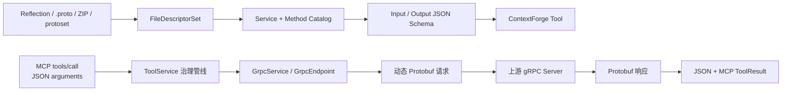
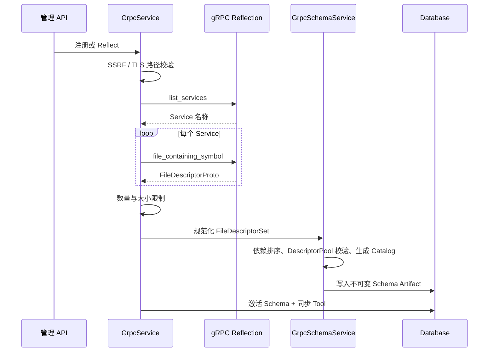
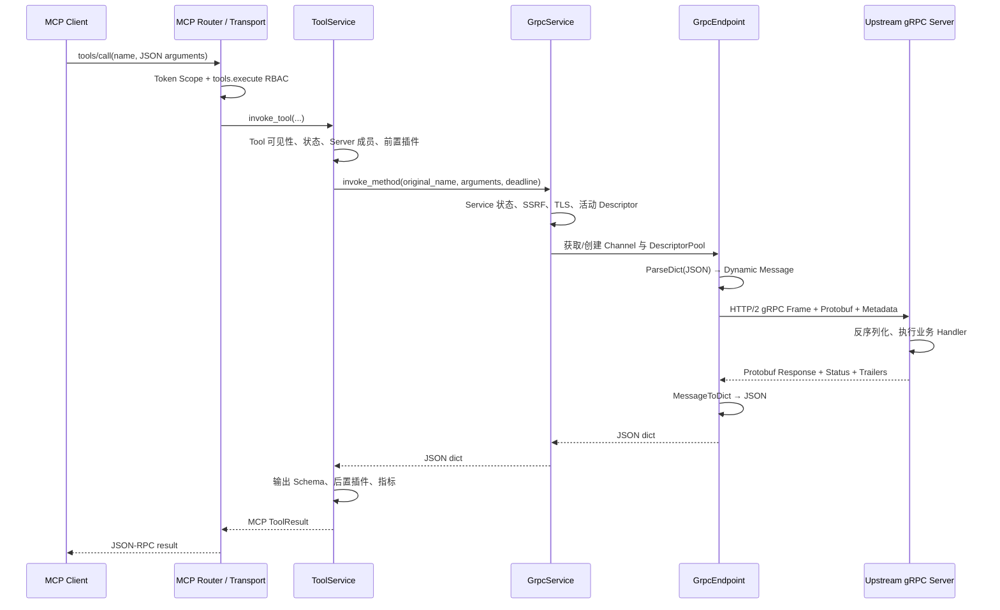
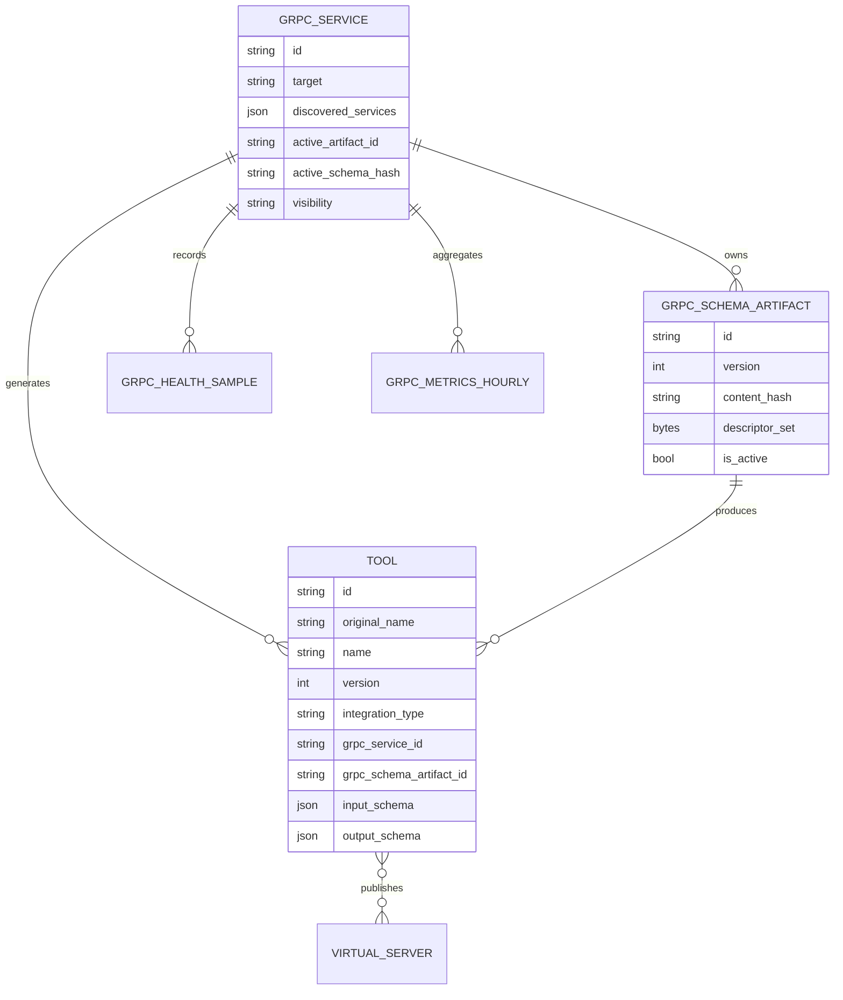

# gRPC 到 MCP Tool 转换技术方案

## 1. 文档说明

| 项目 | 内容 |
| --- | --- |
| 产品 | ContextForge AI Gateway |
| 包版本 | 1.0.7 |
| Git 基线 | `5f2a3af6` |
| 审计日期 | 2026-08-28 |
| 文档状态 | 当前实现说明，不代表未来目标架构 |
| 主要读者 | 架构师、后端开发、平台工程、测试、安全与运维团队 |

本文解释 ContextForge 当前如何把一个 gRPC RPC 方法登记成可治理的 MCP Tool，以及调用时如何完成
JSON → Protobuf → gRPC → Protobuf → JSON 的双向数据转换。

本文聚焦实现原理和源码链路。安装、页面操作和完整 API 示例见
[gRPC Services](../using/grpc-services.md)；ContextForge 全局架构见
[当前技术方案](current-technical-solution-zh.md)。

阅读建议：首次了解先看第 2、3、7 节；开发排障重点看第 4 至 8、15 节；生产上线再核对第 9 至 14、16 节。

!!! warning "“双向转换”不等于“Bidirectional Streaming”"
    本文中的“双向”是指请求和响应两个方向的数据格式转换。当前可执行 Tool 支持一元 RPC 和
    服务端流式 RPC；客户端流式和 gRPC 双向流方法不会生成可执行 Tool。

## 2. 执行摘要

当前生产主链由三个阶段组成：

1. **认识接口**：通过 gRPC Server Reflection，或导入 `.proto`、安全 ZIP、`FileDescriptorSet`，
   得到规范化的 Protobuf 描述符。
2. **生成目录**：从描述符提取 Service、Method、Message 和字段约束，生成 JSON Schema，并同步为
   数据库中的 `Tool` 记录。
3. **动态调用**：MCP 客户端调用 Tool 时，ContextForge 不依赖业务方生成的 `*_pb2.py` Stub，
   而是用 `DescriptorPool` 和动态 `MessageClass` 组装 Protobuf 消息，再通过通用 gRPC Channel
   调用 `/package.Service/Method`。



一句话概括：**Proto 是合同，Descriptor 是机器可读合同，Tool 是对外目录卡片，GrpcEndpoint 是翻译员。**

## 3. 先用一个比喻理解

可以把整条链路想成一家需要接待外国客人的餐厅：

| 技术概念 | 比喻 | 实际作用 |
| --- | --- | --- |
| `.proto` | 菜谱和点餐规则 | 定义服务、方法、消息、字段类型和编号 |
| Server Reflection | 电子菜单查询机 | 运行时询问服务器“你有哪些菜、需要什么参数” |
| `FileDescriptorSet` | 标准化电子菜单 | 编译后的、可被程序直接读取的接口描述 |
| JSON Schema | 给 MCP 客户看的点餐表 | 告诉客户端 Tool 接受哪些 JSON 参数 |
| MCP Tool | 菜单中的一个可点项目 | 把一个 gRPC Method 暴露为可发现、可授权的能力 |
| `DescriptorPool` | 翻译员的术语库 | 保存消息类型定义，动态创建请求/响应类 |
| Protobuf 二进制 | 厨房内部报码 | 紧凑的线上传输格式 |
| gRPC Metadata | 随单附带的证件 | 传递 Authorization、租户等调用元数据 |
| Deadline | 最晚出餐时间 | 限制发现、建连和 RPC 的总耗时 |

需要特别注意：ContextForge 读取 Proto 只是为了理解合同，**不会把 Proto 上传给业务 gRPC Server，
也不会替业务服务实现业务逻辑**。上游服务仍按自己的语言和生成代码处理请求。

## 4. 当前实现边界与组件

### 4.1 两条容易混淆的路径

| 路径 | 当前定位 | 是否是生产主链 |
| --- | --- | --- |
| `GrpcService` + `GrpcSchemaService` + `ToolService` | 注册、持久化、治理和调用 gRPC Tool | 是 |
| `GrpcToMcpTranslator` / `expose_grpc_via_sse()` | 低层转换辅助与 CLI 探测路径 | 否 |

生产主链会把 gRPC Method 持久化为 `DbTool`，然后复用统一的 Tool 鉴权、插件、指标和返回管线。
`GrpcToMcpTranslator` 能把描述符转换成内存中的 Tool 定义，但当前管理式链路不调用它。

`expose_grpc_via_sse()` 当前只连接、反射并保持进程存活，没有真正启动独立的 HTTP/SSE 服务器。
因此生产接入应通过 Admin API/UI 注册 gRPC Service，不能把该函数理解成完整的独立协议网关。

### 4.2 核心组件

| 组件 | 主要职责 |
| --- | --- |
| `GrpcService` | 注册服务、执行反射、激活 Schema、同步 Tool、动态调用 |
| `GrpcSchemaService` | 编译和规范化 Proto、生成 Catalog/JSON Schema、版本和 Diff |
| `GrpcRegistryService` | 注册表视图、同步预览、Method/Tool 状态和数据血缘 |
| `GrpcEndpoint` | Channel、Reflection、DescriptorPool、动态消息和通用 Stub |
| `GrpcRuntimeCache` | 每 Worker 复用 Channel、DescriptorPool 和 MessageClass |
| `ToolService` | Tool 查找、授权上下文、插件、超时、协议分派、结果校验和指标 |
| `GrpcMonitoringService` | Health/Check、Channel Readiness、健康样本和可用率 |
| `ProtoScanService` | 在允许目录内扫描 `grpc-service.yaml` 和 Proto 树 |

## 5. Proto 文件如何被处理

### 5.1 一个最小例子

```proto
syntax = "proto3";
package payment.v1;

service PaymentService {
  rpc CreatePayment(CreatePaymentRequest) returns (CreatePaymentResponse);
}

message CreatePaymentRequest {
  string order_id = 1;
  int64 amount_cent = 2;
  repeated string tags = 3;
}

message CreatePaymentResponse {
  string payment_id = 1;
  string status = 2;
}
```

关键专业名词：

- `package`：Protobuf 命名空间。
- `service`：一组 RPC 方法。
- `rpc`：远程过程调用定义。
- `message`：请求或响应的数据结构。
- 字段编号 `= 1`、`= 2`：Protobuf Wire Format 的 Tag，不是数组下标；发布后不应随意复用。
- `repeated`：零到多个同类型值。

该例的 gRPC Method 全名是
`payment.v1.PaymentService.CreatePayment`，实际 gRPC Method Path 是
`/payment.v1.PaymentService/CreatePayment`。

### 5.2 描述符的三种来源

| `discovery_mode` | 描述符来源 | 当前行为 |
| --- | --- | --- |
| `reflection` | gRPC Server Reflection | 反射结果可自动成为活动 Schema |
| `artifact` | 管理员导入的 Proto/ZIP/protoset | 不执行自动反射，以导入版本为准 |
| `auto` | Reflection 与活动 Artifact 协调 | 无活动版本时采用反射；管理员上传版本可保持权威并报告漂移 |

注册服务后，如果开启 Reflection 且模式不是 `artifact`，`register_service()` 会尝试初次反射。
反射失败不会撤销服务注册；服务可以保留为不可达或随后改用 Artifact。

### 5.3 Reflection 处理链



反射使用一个共享的绝对 Deadline，避免服务数量增加时把总超时按 N 倍放大。反射结果还受到以下固定保护：

- 单个描述符最大 1 MiB；
- 最多 1024 个描述符；
- 描述符总大小最大 8 MiB；
- 使用私有 `DescriptorPool`，不污染进程全局默认池。

!!! note "Reflection Metadata 边界"
    当前 Reflection 请求没有附加服务注册时配置的 `grpc_metadata`。如果 Reflection 本身受
    Authorization Metadata 保护，自动发现会失败；此时应导入 `.proto` 或 protoset。

### 5.4 Proto、ZIP 和 protoset 导入

导入端点接受：

- 单个 `.proto`；
- 包含多个 Proto 和依赖的 ZIP；
- `.protoset`、`.pb`、`.bin` 形式的二进制 `FileDescriptorSet`。

`.proto` 和 ZIP 会在临时目录中调用 `grpc_tools.protoc`，使用
`--include_imports` 和 `--include_source_info` 生成 Descriptor Set。ZIP 在解压前检查：

- 目录穿越和绝对路径；
- 符号链接；
- Entry 数量；
- 解压后总大小；
- 异常压缩比，降低 ZIP Bomb 风险。

Descriptor Set 会按依赖拓扑排序并进行确定性序列化，然后计算 SHA-256。相同服务、相同 Hash 的内容复用
已有 Artifact；新内容获得递增版本。

### 5.5 激活、候选版本与漂移

每个 gRPC Service 保存：

- `active_artifact_id`：当前调用使用的 Schema；
- `candidate_artifact_id`：尚未激活的候选版本；
- `active_schema_hash`：活动版本 Hash；
- `reflected_schema_hash`：最新反射版本 Hash；
- `schema_drift`：活动版本与反射版本是否不同。

Schema 激活与成功生成的 Tool 变更由同一数据库事务提交；未处理的同步异常会整体回滚。单个 Method
生成失败时，当前实现会记录错误并跳过该 Method，因此不能把一次激活理解为“所有 Method 必然完整生成”。
空反射结果不会批量禁用已经发布的 Tool。

## 6. gRPC Method 如何变成 MCP Tool

### 6.1 两层名称

一个生成的 Tool 同时保留两个名字：

| 字段 | 示例 | 用途 |
| --- | --- | --- |
| `original_name` | `payment.v1.PaymentService.CreatePayment` | 精确恢复 gRPC Service 和 Method |
| `name` | `payment-v1-paymentservice-createpayment` | MCP 目录和调用使用的规范化名称 |

`name` 默认由 `slugify(custom_name)` 生成，分隔符由平台配置决定。调用时 `ToolService` 找到 Tool 后，
会把 `original_name` 传给 `GrpcService.invoke_method()`，再从最后一个句点拆出 Method。

因此，客户端看到的 Tool 名和 gRPC Method 全名不一定完全相同。管理员修改 `custom_name` 后，
调用入口名可以变化，但底层 `original_name` 仍保持协议定位。

### 6.2 Tool 字段映射

| Tool 字段 | 生成来源 |
| --- | --- |
| `integration_type` | 固定为 `gRPC` |
| `original_name` | `package.Service.Method` |
| `description` | `gRPC method package.Service.Method` |
| `input_schema` | 请求 Message 转换出的 JSON Schema，加 `x-grpc-*` 扩展 |
| `output_schema` | 响应 Message 转换出的 JSON Schema |
| `url` | gRPC `target`，即 `host:port` |
| `grpc_service_id` | 父 gRPC Service ID |
| `grpc_schema_artifact_id` | 生成当前 Tool 修订的不可变 Schema Artifact ID |
| `version` | Tool 当前修订号；创建时为 1，语义变更时递增 |
| `annotations` | 默认非只读；记录是否 Server Streaming |
| `team_id/owner_email/visibility` | 继承父 gRPC Service |

`input_schema` 还包含：

- `x-grpc-input-type`；
- `x-grpc-output-type`；
- `x-grpc-client-streaming`；
- `x-grpc-server-streaming`；
- 一个自动生成的请求示例。

### 6.3 Protobuf 到 JSON Schema 的映射

| Protobuf | JSON Schema |
| --- | --- |
| `double` / `float` | `number`，附 `double` / `float` format |
| `int32` / `sint32` / `sfixed32` | `integer` |
| `int64` / `sint64` / `sfixed64` | `integer`，部分附 `int64` format |
| `uint32` / `uint64` / `fixed32` / `fixed64` | 非负 `integer` |
| `bool` | `boolean` |
| `string` | `string` |
| `bytes` | `string` + `contentEncoding: base64` |
| `enum` | 字符串枚举 |
| `message` | 嵌套对象，通过 `$defs` / `$ref` 复用 |
| `repeated T` | `array`，`items` 为 T 的 Schema |
| `map<K,V>` | `object`，`additionalProperties` 为 V 的 Schema |

Well-Known Types 的特殊处理包括：

- `google.protobuf.Timestamp` → `date-time` 字符串；
- `google.protobuf.Duration` → 带格式约束的字符串；
- `Any`、`Struct` → 可扩展对象；
- `Value` → 任意 JSON 值。

Proto2 `required` 字段进入 JSON Schema 的 `required`。`oneof` 当前记录为
`x-protobuf-oneof` 提示，不会转换成强制互斥的标准 `oneOf` 约束。

!!! note "Schema 与 Protobuf JSON 语义并非完全等价"
    JSON Schema 是给 MCP 客户端的近似合同，最终转换仍由
    `google.protobuf.json_format.ParseDict` 决定。例如 64 位整数、未知字段、枚举、`oneof` 和
    Well-Known Types 应按真实边界值做兼容测试。

### 6.4 四种 RPC 模式

| gRPC 方法类型 | 是否生成可执行 Tool | MCP 返回方式 |
| --- | --- | --- |
| Unary → Unary | 是 | 单个 JSON 对象 |
| Unary → Server Stream | 是 | 普通 MCP 调用聚合为 `items`，最多 100 条 |
| Client Stream → Unary | 否 | 仅保留在 gRPC Catalog 中 |
| Bidirectional Stream | 否 | 仅保留在 gRPC Catalog 中 |

MCP Tool 的天然形态是“一次参数输入，一次结果输出”。客户端流和双向流需要持续输入、背压和半关闭语义，
当前统一 Tool 接口没有承载这些语义，因此采用“可发现但不执行”的保守策略。

### 6.5 增量同步而不是删表重建

激活新 Schema 后，`_sync_tools_from_reflection()` 采用稳定身份策略：

- 新 Method 创建新 Tool；
- Schema 或父级可见性变化时原地更新并增加版本；
- 消失的 Method 被设为 `enabled=false`、`deprecated=true`、`reachable=false`；
- Method 重新出现时复用原 Tool ID 并重新启用；
- Client Streaming Method 不生成 Tool，已有 Tool 会被软禁用；
- 保留 Virtual Server 关联、历史指标和管理员自定义名称/描述；
- 提交后失效 Tool Registry、Lookup 和 Result Cache。

这相当于“员工暂时离职先停用工牌，不直接销毁全部档案”，便于审计、回滚和 Schema 重新出现时恢复。

每个生成 Tool 还直接绑定产生该修订的 `grpc_schema_artifact_id`。即使新旧 JSON Schema 投影相同，
只要活动 Descriptor Artifact 改变，绑定和 Tool `version` 仍会更新，避免执行所用 Wire Contract 与页面展示、
导出包引用的 Descriptor 不一致。

Tool 版本采用当前状态上的乐观并发控制：更新请求可提交 `expectedVersion`，服务以数据库中的版本做条件更新；
版本已被其他请求推进时返回 `409 Conflict`。无实际字段变化的更新不会升版。这里的 `version` 不是历史表，
当前没有 Tool 修订快照、Diff 或按版本回滚；gRPC Schema Artifact 本身则继续保留不可变版本历史。

!!! note "Virtual Server 不是自动创建的"
    gRPC Schema 同步只生成 Tool，不会自动创建 Virtual Server，也不会自动把 Tool 关联到某个
    Virtual Server。需要 Server 范围发布时，管理员仍需显式建立 Tool 与 Server 的关联。

### 6.6 Tool Definition、Source 与便携包

Admin UI 的 Tool 详情提供三个互补视图：

- **Details**：目录字段、状态和管理元数据；
- **Definition**：规范化、可复制和可下载的 Tool JSON 定义；
- **Source**：来源绑定与可追溯信息。gRPC Tool 显示 Service、Method、Artifact 版本、SHA-256 以及
  Descriptor 派生的 Method/Source 信息。

ContextForge 不保存上传前的原始 `.proto` 文本，因此 Source 视图不会伪造源码；
`exactSourceAvailable=false` 明确说明内容来自不可变 Descriptor Set。需要精确保留注释、排版或业务仓库路径时，
仍应把原始 Proto 放在业务代码仓库或制品库中。

单个 Tool 可导出为 `*.tool.json`，用于审阅定义；需要跨实例恢复 gRPC 依赖时应使用多选导出的
`*.toolpkg.zip`。便携包包含：

- `manifest.json`：Tool 定义、来源绑定、内容 Hash 和依赖索引；
- `artifacts/grpc/<sha256>.protoset`：去重后的规范化 Descriptor Set；
- `security.secretsIncluded=false` 与 `ownershipIncluded=false`：声明包不携带凭据和源实例所有权。

导出会过滤认证信息和敏感 Header，不包含 gRPC Metadata、TLS 私钥或证书路径。导入端先校验 ZIP 路径、
条目数、解压大小、重复成员、Manifest/Tool/Descriptor Hash、依赖引用和扩展元数据，再提供不写库的 Preview。
确认时可选择 `skip`、`update` 或 `fail` 冲突策略；目标实例重新应用当前用户的 Owner、Team、Visibility 和
RBAC 规则：新建资源归导入者所有并设为 `private`，复用既有资源时保留目标实例已有的 Team 和 Visibility。
包含 gRPC 依赖的包在 `MCPGATEWAY_GRPC_ENABLED=false` 时会被 Preview 阻断，纯 REST 包仍可校验和导入。

通用 API 位于 `/v1/tools/{id}/definition`、`/source`、`/export`、`/v1/tools/export`、
`/v1/tools/import/preview` 和 `/v1/tools/import`；Admin UI 使用对应的 `/v1/admin/tools/...` 路由。
Definition/Source 读取要求 `tools.read`；包操作还受 `admin.grpc`、Tool 创建/更新权限及 Layer-1 可见性约束。

!!! warning "批量导入的事务边界"
    `fail` 会在写入前扫描已知的 gRPC/REST 冲突，但底层 Service、Schema 和 Tool 服务当前仍各自提交事务。
    数据库断连或非预期运行时异常可能在后半程失败并留下已经提交的前置项。生产导入前应先 Preview、备份，
    失败后按返回结果和审计记录核对；真正的全原子导入需要后续把各服务改造成统一事务的 flush-only 写入路径。

## 7. 调用时如何双向转换

### 7.1 完整调用时序



### 7.2 入口治理

在连接 gRPC Server 之前，统一入口已经完成：

1. MCP/JSON-RPC 请求解析；
2. Token Scope 可见性过滤；
3. `tools.execute` RBAC；
4. Tool 是否启用、可达、未废弃；
5. 有 `server_id` 时校验 Virtual Server 成员关系；
6. Tool 前置插件，可拒绝或修改参数；
7. 统一 Deadline 计算。

因此 gRPC 适配器不是一条绕过治理的旁路。

### 7.3 JSON 请求如何变成 Protobuf

`GrpcService.invoke_method()` 先读取活动 Descriptor，并从
`payment.v1.PaymentService.CreatePayment` 拆出：

- Service：`payment.v1.PaymentService`；
- Method：`CreatePayment`。

随后 `GrpcEndpoint`：

1. 从私有 `DescriptorPool` 查找请求和响应 Message Descriptor；
2. 用 `message_factory.GetMessageClass()` 动态创建并缓存 Python Message Class；
3. 用 `json_format.ParseDict(arguments, RequestClass())` 将 JSON 填入动态消息；
4. 构造通用调用器：
   `channel.unary_unary("/payment.v1.PaymentService/CreatePayment", ...)`；
5. 以 `SerializeToString` 作为请求序列化器。

这里没有导入业务方生成的 `payment_pb2.py`。Descriptor 相当于运行时蓝图，MessageClass 是按蓝图临时
制造的容器。

### 7.4 数据如何发到服务器

gRPC Python Runtime 负责：

- 在 Channel 上建立或复用 HTTP/2 连接；
- 把 Protobuf 二进制放入 gRPC Message Frame；
- 发送 Method Path、Deadline 和 Metadata；
- 接收 Header、Message、Trailer 和最终 gRPC Status。

服务注册时保存的 Metadata 会加密入库，只在出站边界解密。API Debugger 可提供只对本次调用生效的
Metadata Override；同名 Key 由本次值覆盖，且不会持久化。

### 7.5 上游服务器如何处理

上游 gRPC Server 通常在构建阶段已经用 Proto 生成语言相关代码，例如 Python Servicer、Java Service
Base 或 Go Server Interface。请求到达后：

1. gRPC Runtime 根据 Method Path 找到 Handler；
2. 用请求 Message 类型反序列化 Protobuf；
3. 调用业务函数；
4. 业务函数返回响应 Message，或设置非 OK gRPC Status；
5. Runtime 把响应序列化为 Protobuf 并写回 HTTP/2 Stream。

ContextForge 不参与上游业务函数内部处理，只负责调用前后的协议和治理。

### 7.6 Protobuf 响应如何返回 MCP

`GrpcEndpoint` 使用动态响应类的 `FromString` 反序列化，再调用：

```python
json_format.MessageToDict(
    response_msg,
    preserving_proto_field_name=True,
    always_print_fields_with_no_presence=True,
)
```

这意味着：

- JSON 保留 Proto 的 `snake_case` 字段名；
- 无 Presence 的默认标量也会输出；
- `bytes` 等字段遵循 Protobuf JSON 表示。

`ToolService` 随后：

1. 用 `orjson` 序列化为 MCP `TextContent`；
2. 根据生成的 `output_schema` 尝试提取和校验 `structuredContent`；
3. 执行 Tool 后置插件；
4. 返回 MCP `CallToolResult`；
5. 记录 Tool 和 gRPC 指标。

### 7.7 一次完整示例

假设 MCP 目录中暴露的名称为
`payment-v1-paymentservice-createpayment`。

请求：

```json
{
  "jsonrpc": "2.0",
  "id": 7,
  "method": "tools/call",
  "params": {
    "name": "payment-v1-paymentservice-createpayment",
    "arguments": {
      "order_id": "O-1001",
      "amount_cent": 9900,
      "tags": ["web", "vip"]
    }
  }
}
```

中间的动态消息等价于：

```text
CreatePaymentRequest(
  order_id = "O-1001",
  amount_cent = 9900,
  tags = ["web", "vip"]
)
```

代表性响应：

```json
{
  "jsonrpc": "2.0",
  "id": 7,
  "result": {
    "content": [
      {
        "type": "text",
        "text": "{\n  \"payment_id\": \"P-9001\",\n  \"status\": \"CREATED\"\n}"
      }
    ],
    "structuredContent": {
      "payment_id": "P-9001",
      "status": "CREATED"
    },
    "isError": false
  }
}
```

具体字段是否省略、数字如何表示以及错误 Envelope，以活动 Schema、MCP SDK 和 Protobuf JSON 规则为准。

### 7.8 Server Streaming

Server Streaming 调用使用 `channel.unary_stream()`。每个 Protobuf Message 都会立即转换成 JSON。

普通 MCP 调用会在一个 Deadline 内最多收集 100 条：

```json
{
  "items": [
    {"message": "chunk-1"},
    {"message": "chunk-2"}
  ],
  "truncated": false
}
```

统一 Debugger 的 SSE 路径可以通过 Callback 逐条发送。若启用了 Tool 后置插件，流项目会先缓冲，
等后置治理完成后再发送，避免未脱敏结果绕过输出策略。

!!! warning "当前 Server Streaming Schema 限制"
    生成 Tool 的 `output_schema` 描述的是单条响应 Message，而普通 MCP 调用返回的是
    `{items, truncated}` 包装对象。当前统一输出校验可能把两者判为不匹配，不能承诺所有
    Server Streaming Tool 都会产生成功的 `structuredContent`。上线前应按具体 Method 做端到端验证。

## 8. Deadline、取消和错误

### 8.1 Deadline 优先级

统一 Tool Deadline 的优先级为：

1. 调用方显式 Override；
2. Tool 的 `timeout_ms`；
3. `MCPGATEWAY_GRPC_TIMEOUT`；
4. 通用 Tool 超时只作为未知协议兜底。

同一个剩余时间预算覆盖 Endpoint 启动、必要的 Reflection 和实际 RPC。外层 `asyncio.wait_for` 与底层
gRPC `timeout` 同时设置，避免协程取消后慢速同步 RPC 长时间占用执行器线程。

### 8.2 典型错误映射

| 场景 | 网络调用 | 对外结果 |
| --- | --- | --- |
| Tool 不可见或不属于 Server | 不发生 | Tool Not Found / Access Denied |
| `ParseDict` 类型或字段错误 | 业务 RPC 不发生；必要的前置 Reflection 可能已发生 | `isError=true` 的 gRPC invocation error |
| Service Disabled | 不发生 | `isError=true` |
| gRPC 非 OK Status | 已发生 | Status 进入指标，结果为 `isError=true` |
| Deadline 到期 | 可能已发起 | 取消/超时语义，指标记 `DEADLINE_EXCEEDED` |
| 前置插件拒绝 | 不发生 | 策略拒绝 |
| 后置插件拒绝 | 已发生 | 上游已执行，但结果不会正常返回 |

Unary 调用在同步执行器线程中完成；协程取消不会把 Python 线程强制杀死，所以底层 gRPC Deadline 是资源
回收的重要保障。Server Stream 提前结束或超限时会取消底层 Stream。

## 9. 安全方案

### 9.1 功能与权限

- 源码配置 `MCPGATEWAY_GRPC_ENABLED=false`，属于实验性可选能力；
- 发布镜像或部署清单可能显式覆盖开启，生产必须核对最终生效环境；
- 该开关控制管理路由、监控和扫描任务的装配；既有内部 gRPC Tool 调用分支不会再次读取该开关，
  因而不能把运行时改值当作绝对 Kill Switch；
- gRPC 管理接口要求 `admin.grpc`；
- Tool 发现和执行继续要求对应的 `tools.read` / `tools.execute`；
- 生成 Tool 继承父服务的 Team、Owner 和 Visibility。

### 9.2 出站网络与 TLS

每次反射和调用前都校验 gRPC Target：

- 支持 `host:port`、括号 IPv6 和部分 gRPC DNS Resolver 形式；
- 拒绝 `unix:`、`vsock:`、`fd:` 等绕过 IP 策略的本地 Scheme；
- 复用平台 SSRF Host、Network、DNS 和私网策略；
- 保留对云元数据、Link-local、Reserved 和 Multicast 的防护。

TLS 文件只能位于受允许的证书目录。`tls_enabled=false` 时使用明文 `insecure_channel`；启用 TLS 后，
证书语义为：

- 仅 `tls_cert_path`：作为 Root CA；
- `tls_cert_path` + `tls_key_path`：作为客户端证书链与私钥；
- 两者都没有：使用系统信任根；
- 只有 Key 没有 Cert：拒绝。

生产还应使用 NetworkPolicy、防火墙和精确出口 CIDR，不能只依赖应用内 SSRF 校验。

### 9.3 Metadata 和 Descriptor

- `grpc_metadata` 值加密入库；
- API 返回统一显示为 `********`；
- Debugger 对敏感 Header/Trailer Key 再次遮罩；
- Runtime Cache Key 只保留服务 ID 和 Hash，不记录凭据、Target 或证书路径明文；
- 反射 Tool 名经过长度、字符和内容注入校验；
- 不受信任 Descriptor 放入私有 Pool，并受数量/大小约束。

## 10. 数据模型与事务



重要事务边界：

- Schema 激活与 Tool 同步同事务；
- Tool 调用使用新的短生命周期数据库 Session 读取 gRPC Service；
- 外部网络调用前，统一 Tool 管线尽量释放原请求 Session；
- 指标、健康样本和部分观测数据使用独立 Session，属于尽力持久化。

## 11. 性能与多副本行为

### 11.1 Runtime Cache

默认每个 Worker 使用一个最多 64 项的进程内 LRU Cache，Entry 包含：

- gRPC Channel；
- 私有 DescriptorPool；
- 按完整类型名缓存的 MessageClass。

Cache Key 包含 Service ID、活动 Schema Hash（为空时使用最新 Reflection Hash）、Target、TLS 材料摘要和
Metadata 指纹。Schema 激活、Target 或证书变化会产生新 Key；显式更新和删除也会按 Service 失效。

Entry 使用引用计数，LRU 淘汰不会关闭正在执行调用的 Channel。缓存 Channel 配有 Keepalive 和最大接收消息大小。

### 11.2 多 Worker 边界

Runtime Cache 是进程内状态，不跨 Worker/Pod 同步。数据库仍是 Schema 和 Tool 的权威来源；其他 Worker
在下次读取新 Service 配置或 Schema Hash 后使用新 Cache Key。部署时不应把某个 Worker 的暖连接当作
全局共享连接池。

### 11.3 健康检查

健康监控优先调用标准 `grpc.health.v1.Health/Check`。上游返回 `UNIMPLEMENTED` 或未安装 Health 依赖时，
回退到 Channel Readiness。连续失败达到阈值后 Service 进入 Unhealthy，并更新 `reachable`。

后台监控只由 Primary Worker 调度，支持并发上限、Interval Jitter、Channel 复用和 30 天健康样本保留。

## 12. 可观测性

当前链路记录：

- `grpc.client.call` 和 `grpc.reflection` Trace Span；
- `grpc_client_calls_total`，维度为 Service、Method、Status；
- `grpc_client_duration_seconds`；
- `grpc_reflection_total`；
- `grpc_health_checks_total` 和 `grpc_health_status`；
- ToolMetric 中的成功、响应时间、请求/响应字节和 gRPC Status；
- gRPC 小时汇总及 P50/P95/P99 趋势。

Status 值通过 `ContextVar` 从 `GrpcService` 传回 `ToolService`，避免并发调用互相覆盖。

## 13. 关键配置

| 配置 | 源码默认 | 作用 |
| --- | --- | --- |
| `MCPGATEWAY_GRPC_ENABLED` | `false` | 管理 API 与后台任务启动开关；并非调用级 Kill Switch |
| `MCPGATEWAY_GRPC_TIMEOUT` | `30` 秒 | 默认调用 Deadline |
| `MCPGATEWAY_GRPC_MAX_MESSAGE_SIZE` | 4 MiB | Runtime Cache / Health Channel 的最大接收消息大小 |
| `MCPGATEWAY_GRPC_HEALTH_ENABLED` | `true` | 开启健康监控 |
| `MCPGATEWAY_GRPC_HEALTH_INTERVAL` | 60 秒 | 健康检查周期 |
| `GRPC_RUNTIME_CACHE_ENABLED` | `true` | 每 Worker 复用运行时资源 |
| `GRPC_RUNTIME_CACHE_MAX_ENTRIES` | 64 | 每 Worker Cache 上限 |
| `MCPGATEWAY_PROTO_SCAN_ENABLED` | `false` | 开启 Manifest 扫描 |
| `MCPGATEWAY_PROTO_MAX_UPLOAD_BYTES` | 8 MiB | Proto Artifact 上传上限 |

`MCPGATEWAY_GRPC_REFLECTION_ENABLED` 和 `MCPGATEWAY_GRPC_TLS_ENABLED` 虽然存在于 Settings，
当前创建 Schema 的每服务默认值仍分别由 `GrpcServiceCreate` 的 `true` / `false` 决定。部署者应在
每个 Service 注册参数中明确填写，不要假定这两个全局默认一定生效。

`MCPGATEWAY_GRPC_MAX_MESSAGE_SIZE` 当前没有统一注入所有非缓存调用与 Reflection Channel。若要把它作为
严格的全路径报文上限，需要先补齐实现并做大报文回归测试。

安装还需要 `[grpc]` Optional Extra，包括 `grpcio`、`grpcio-reflection`、
`grpcio-health-checking`、`grpcio-tools` 和 `protobuf`。

## 14. 已知限制

| 限制 | 当前影响 | 建议 |
| --- | --- | --- |
| Client Streaming / Bidi 不执行 | 只能在 Catalog 查看 | 改造成领域级批量 Tool，或等待专用流式桥接 |
| 独立 CLI 不提供完整 SSE Server | `--grpc` 仅探测并保持连接 | 使用管理式 gRPC Service |
| Reflection 不带注册 Metadata | 受保护 Reflection 发现失败 | 上传 Proto/protoset |
| Server Stream Wrapper 与 Output Schema 不同形 | 可能触发输出校验错误 | 对具体 Method 做 E2E，必要时使用 Debugger |
| JSON Schema 是近似映射 | 不能表达全部 Proto 语义 | 以 `ParseDict` 和真实服务测试为准 |
| Custom Options 未进入 Tool 语义 | 业务约束可能丢失 | 在插件或业务适配层显式校验 |
| 没有完整 Wire-Compatible Linter | Diff 只到 Service/Method 指纹 | 在 Proto CI 中使用专用兼容性检查 |
| Tool 不自动加入 Virtual Server | Server 范围内不可见 | 显式关联 Tool |
| Runtime Cache 为每进程 | 多副本各自建 Channel | 按 Pod/Worker 做连接预算 |
| 功能开关不是调用级 Kill Switch | 改值不阻止已登记 Tool 的内部调用 | 先禁用 Tool/Service，再滚动重启 |
| 最大消息配置未覆盖全部 Channel | 非缓存调用和 Reflection 仍可能采用 Runtime 默认值 | 入口限载，并补齐统一 Channel Option |
| 不保留原始 `.proto` 文本 | Source 只能展示 Descriptor 派生内容 | 在业务仓库或制品库保留原文件 |
| Tool 版本只保存当前值 | 不能查看 Tool 修订 Diff 或直接回滚 | 使用导出包留档；gRPC 回滚使用不可变 Schema Artifact |

## 15. 源码索引

| 主题 | 关键实现 |
| --- | --- |
| gRPC 管理 API | `mcpgateway/admin.py` |
| Schema、Registry、Health API | `mcpgateway/routers/grpc_schema.py` |
| 注册、反射、Tool 同步、调用 | `mcpgateway/services/grpc_service.py` |
| Proto 编译、JSON Schema、版本 | `mcpgateway/services/grpc_schema_service.py` |
| gRPC Registry / 同步预览 | `mcpgateway/services/grpc_registry_service.py` |
| Channel 与动态消息 | `mcpgateway/translate_grpc.py` |
| Runtime Cache | `mcpgateway/services/grpc_runtime_cache.py` |
| 健康监控 | `mcpgateway/services/grpc_monitoring_service.py` |
| Target / TLS 校验 | `mcpgateway/utils/grpc_validation.py` |
| 统一 Tool 执行 | `mcpgateway/services/tool_service.py` |
| Tool Definition、Source 与便携包 | `mcpgateway/services/tool_portability_service.py` |
| gRPC ORM | `mcpgateway/db.py` |
| Tool / Service Schema | `mcpgateway/schemas.py` |

## 16. 测试与验收

仓库已有真实 gRPC Test Server 和全链路测试：

- `tests/grpc_test_server/echo.proto`；
- `tests/grpc_test_server/server.py`；
- `tests/integration/test_grpc_full_chain.py`；
- `tests/unit/mcpgateway/services/test_grpc_service.py`；
- `tests/unit/mcpgateway/services/test_grpc_schema_service.py`；
- `tests/unit/mcpgateway/services/test_tool_portability_service.py`；
- `tests/unit/mcpgateway/db/test_grpc_tool_artifact_migration.py`；
- `tests/unit/mcpgateway/test_translate_grpc.py`。

生产接入至少验证：

1. Reflection 和 Artifact 两条发现路径；
2. Unary 正常、非法参数、各类 gRPC Status 和 Deadline；
3. TLS、mTLS、Metadata Auth 与证书轮换；
4. Team/Public/Private、错误团队和 `tools.execute` 拒绝路径；
5. Schema 新增、修改、删除、回滚、空反射和 Drift；
6. Server Streaming 的 100 条上限、提前取消和输出 Schema；
7. 多 Worker Cache、连接数、上游重启和滚动发布；
8. 日志、Trace、指标和 Debug History 中无明文凭据。
9. Tool Definition/Source 权限、包 Preview/Import、冲突策略、Hash、ZIP 边界和关闭 gRPC 的拒绝路径。

## 17. 相关文档

- [ContextForge 当前技术方案](current-technical-solution-zh.md)
- [gRPC Services 操作指南](../using/grpc-services.md)
- [中文产品使用手册](../using/product-user-manual-zh.md#82-grpc-services)
- [配置参考](../manage/configuration.md)
- [Prometheus gRPC 指标](../manage/observability/prometheus.md)
- [Tool 调用与输出校验](tool-invocation-and-validation.md)
- [REST/gRPC 未来模块 Profile](modular-runtime/rest-grpc-module.md)
