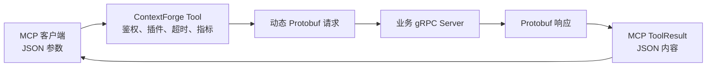

# gRPC 服务使用指南（实验性）

!!! warning "实验性可选功能"
    gRPC 支持在源码配置中默认关闭，需要安装额外依赖并显式启用。当前 `.env.example`、发布镜像、
    Compose 和 Helm 配置会显式开启，部署时必须检查最终生效值。

ContextForge 可以把已有的 gRPC 方法转换成受治理的 MCP Tool。MCP 客户端使用 JSON 调用 Tool，
ContextForge 在后台将 JSON 转成 Protobuf，调用真正的 gRPC Server，再把 Protobuf 响应转回 MCP 结果。

本文重点回答“如何配置、如何调用、失败时如何排查”。源码级实现见
[gRPC 到 MCP Tool 转换技术方案](../architecture/grpc-to-mcp-tool-translation-zh.md)。

## 1. 先用一分钟理解它

### 1.1 它解决什么问题

gRPC 很适合服务间高效通信，但普通 MCP 客户端不认识 Protobuf 二进制，也不会加载业务系统生成的
`*_pb2.py`、Java Stub 或 Go Client。

可以把这条链路想成餐厅点餐：

| 技术概念 | 比喻 | 实际作用 |
| --- | --- | --- |
| `.proto` | 菜谱和点餐合同 | 定义 Service、Method、请求、响应和字段类型 |
| Server Reflection | 查询电子菜单 | 运行时向服务器询问它公开了哪些接口 |
| Descriptor / protoset | 机器可读菜单 | 动态创建 Protobuf 消息的依据 |
| MCP Tool | 对客人展示的菜品卡 | 让 MCP 客户端发现并调用一个 gRPC Method |
| ContextForge | 带门禁的翻译员 | 完成鉴权、治理和 JSON/Protobuf 转换 |
| gRPC Server | 真正做菜的厨房 | 执行业务逻辑 |



一句话概括：**Proto 是合同，Tool 是菜单，ContextForge 是同时负责翻译和门禁的服务员。**

### 1.2 初学者需要知道的术语

| 术语 | 含义 |
| --- | --- |
| gRPC Service | 一组相关 RPC Method |
| RPC Method | 可以远程调用的函数 |
| Message | 请求或响应的数据结构 |
| Reflection | 运行时查询服务器接口合同的机制 |
| MCP Tool | MCP 客户端可以发现和调用的有类型能力 |
| Metadata | 随 gRPC 调用发送的认证、租户等键值对 |
| Deadline | 一次调用允许使用的最长时间 |
| Virtual Server | 把选定 Tool 发布给指定客户端的逻辑边界 |

### 1.3 当前支持哪些 RPC 模式

| gRPC 模式 | 能否生成可执行 Tool | MCP 返回方式 |
| --- | --- | --- |
| Unary → Unary | 支持 | 一个 JSON 对象 |
| Unary → Server Stream | 支持 | 普通调用聚合为 `{items, truncated}`，最多 100 条 |
| Client Stream → Unary | 暂不支持 | 只在 gRPC Catalog 中展示 |
| Bidirectional Stream | 暂不支持 | 只在 gRPC Catalog 中展示 |

“JSON/Protobuf 双向转换”是指请求和响应两个方向的数据转换，不代表已支持 gRPC Bidirectional Streaming。

## 2. 开始前检查

开始前确认：

1. 已安装 `[grpc]` 可选依赖。
2. `MCPGATEWAY_GRPC_ENABLED=true` 已进入实际运行进程，并已重启。
3. 准备使用的管理入口已启用：页面操作需要 Admin UI，API 操作需要 Admin API；管理员拥有 `admin.grpc` 权限。
4. ContextForge 能访问目标 `host:port`，SSRF 和网络策略允许该地址。
5. 调用者拥有 Tool 可见范围以及 `tools.read`、`tools.execute` 权限。
6. 已决定使用 Reflection，还是上传 Proto/ZIP/protoset。
7. 生产环境已明确 TLS、Metadata 凭据、Team 和 Visibility。

### 2.1 如何选择发现方式

| 场景 | 推荐模式 |
| --- | --- |
| 上游开放 Server Reflection | `reflection` 或 `auto` |
| 上游未开放 Reflection | `artifact`，上传 Proto/ZIP/protoset |
| Reflection 本身需要 Authorization Metadata | 使用上传 Artifact |
| 上传版本保持权威，同时希望发现线上差异 | `auto` |
| Schema 必须经过审批后切换 | 上传候选版本、Preview/Diff、再激活 |

!!! important "受保护 Reflection 的边界"
    管理式 Reflection 当前不会附加服务记录中保存的 `grpc_metadata`。业务 RPC 会携带这些 Metadata，
    但受保护的 Reflection 仍可能失败，此时请上传 Proto 或 protoset。

## 3. 安装并启用

### 3.1 安装 gRPC 依赖

使用发布包时安装 `[grpc]` Extra：

```bash
# pip
pip install "mcp-contextforge-gateway[grpc]"

# uv
uv pip install "mcp-contextforge-gateway[grpc]"
```

该 Extra 包含 `grpcio`、Reflection、Health Checking、`grpcio-tools` 和 `protobuf` 等依赖；
精确版本以仓库 `pyproject.toml` 为准。

从源码开发时使用仓库标准安装流程：

```bash
make install-dev
```

### 3.2 启用并重启

```dotenv
MCPGATEWAY_GRPC_ENABLED=true
```

```bash
# 开发模式
make dev

# 已安装的生产命令
mcpgateway

# Compose
docker compose restart gateway
```

### 3.3 验证功能是否装配

1. 打开 `http://localhost:4444/admin`，确认出现 **gRPC Services**。
2. 或使用有 `admin.grpc` 权限的令牌调用管理 API：

```bash
export BASE_URL="http://localhost:4444"
export TOKEN="<YOUR_JWT_TOKEN>"

curl -i \
  -H "Authorization: Bearer $TOKEN" \
  "$BASE_URL/admin/grpc"
```

404 通常表示 gRPC 或 Admin API 未装配；关闭 UI 不会影响该 API。401/403 表示认证或权限问题。

### 3.4 本地地址与 SSRF

ContextForge 会在创建 Channel 前校验 Target。源码安全默认不允许 Localhost 和私网；本项目的
`.env.example`、发布镜像、Compose 和 Helm 会显式允许 Localhost/RFC 1918 私网，同时保留云元数据、
Link-local、Reserved、Multicast 和 DNS 失败防护。

本地 `localhost:50051` 被拒绝时，检查最终生效的：

```dotenv
SSRF_PROTECTION_ENABLED=true
SSRF_ALLOW_LOCALHOST=true
SSRF_ALLOW_PRIVATE_NETWORKS=true
```

严格生产环境应将后两项设为 `false`，再通过 `SSRF_ALLOWED_NETWORKS` 精确放行必要 CIDR。默认差异见
[1.0.0-RC3 升级说明](../manage/upgrade-to-1.0.0-rc3.md)。

## 4. 五分钟最小闭环

仓库自带一个测试用 gRPC Echo Server，包含 Reflection、Unary、Server Streaming、Metadata 和错误场景，
适合第一次验证。以下命令从仓库根目录执行。

### 4.1 启动测试 gRPC Server

```bash
.venv/bin/python tests/grpc_test_server/server.py --port 50051
```

保持该终端运行。它会公开 `grpc_test.EchoService.Echo` 等 Method。

### 4.2 通过 Admin API 注册

另开终端，准备 `BASE_URL` 和 `TOKEN`：

```bash
export BASE_URL="http://localhost:4444"
export TOKEN="<YOUR_JWT_TOKEN>"
```

注册服务：

```bash
curl -sS -X POST "$BASE_URL/admin/grpc" \
  -H "Authorization: Bearer $TOKEN" \
  -H "Content-Type: application/json" \
  -d '{
    "name": "local-grpc-echo",
    "target": "localhost:50051",
    "description": "本地 gRPC Echo 示例",
    "reflection_enabled": true,
    "discovery_mode": "reflection",
    "tls_enabled": false,
    "visibility": "public",
    "tags": ["demo", "grpc"]
  }'
```

成功时返回 201。复制响应中的 `id`：

```bash
export SERVICE_ID="<SERVICE_ID>"
```

!!! note "注册成功不等于 Reflection 一定成功"
    服务记录会先提交，初次 Reflection 是尽力执行。即使上游暂时不可达，注册也可能成功并显示
    Unreachable；修复网络后可重新 Reflect，或上传 Schema。

也可以使用 UI 完成同一操作：进入 **Admin UI → gRPC Services → Register gRPC Service**，填写名称、
Target、Reflection、Discovery Mode、TLS、Health、Team 和 Visibility。当前 UI 不提供 Metadata 和 Tags
输入，需要这些字段时使用 API。

### 4.3 检查发现结果

```bash
# 服务详情
curl -sS \
  -H "Authorization: Bearer $TOKEN" \
  "$BASE_URL/admin/grpc/$SERVICE_ID"

# Method 列表
curl -sS \
  -H "Authorization: Bearer $TOKEN" \
  "$BASE_URL/admin/grpc/$SERVICE_ID/methods"
```

重点检查 `reachable`、`last_reflection_error`、活动 Schema 和 Method 数量。应能看到
`grpc_test.EchoService.Echo`。

### 4.4 通过 `tools/list` 获取真实 Tool 名

不要根据注册服务名猜 Tool 名。完整 gRPC 名会被 Slugify，例如
`grpc_test.EchoService.Echo` 默认变成 `grpc-test-echoservice-echo`。

```bash
curl -sS -X POST "$BASE_URL/rpc" \
  -H "Authorization: Bearer $TOKEN" \
  -H "Content-Type: application/json" \
  -d '{
    "jsonrpc": "2.0",
    "id": 1,
    "method": "tools/list",
    "params": {}
  }'
```

实际名称和参数始终以返回的 `name`、`inputSchema` 为准。安装了 `jq` 时可以过滤：

```bash
curl -sS -X POST "$BASE_URL/rpc" \
  -H "Authorization: Bearer $TOKEN" \
  -H "Content-Type: application/json" \
  -d '{"jsonrpc":"2.0","id":1,"method":"tools/list","params":{}}' |
jq '.result.tools[] | select(.name | contains("echo"))'
```

### 4.5 调用 Tool

```bash
export TOOL_NAME="grpc-test-echoservice-echo"

curl -sS -X POST "$BASE_URL/rpc" \
  -H "Authorization: Bearer $TOKEN" \
  -H "Content-Type: application/json" \
  -d "{
    \"jsonrpc\": \"2.0\",
    \"id\": 2,
    \"method\": \"tools/call\",
    \"params\": {
      \"name\": \"$TOOL_NAME\",
      \"arguments\": {
        \"message\": \"你好，gRPC\",
        \"value\": 2
      }
    }
  }"
```

代表性结果：

```json
{
  "jsonrpc": "2.0",
  "id": 2,
  "result": {
    "content": [
      {
        "type": "text",
        "text": "<JSON 文本>"
      }
    ],
    "structuredContent": {
      "message": "echo: 你好，gRPC",
      "value": 4,
      "server_id": "..."
    },
    "isError": false
  }
}
```

`structuredContent` 只有在输出 Schema 校验成功时才会出现；`content` 中的 JSON 文本是基础返回形式。

### 4.6 发布到 Virtual Server

Schema 同步只生成 Tool，不会自动创建 Virtual Server，也不会自动加入现有 Server。正式发布时：

1. 进入 **Admin UI → Servers**。
2. 创建或编辑 Virtual Server。
3. 在关联 Tools 中选择生成的 gRPC Tool。
4. 使用 `/servers/{server_id}/mcp` 完成 MCP 初始化、`tools/list` 和 `tools/call` 验证。

根 `/rpc` 适合管理验证；正式 MCP Session 应使用 MCP Inspector 或正式 SDK。

## 5. 刚才发生了什么

1. ContextForge 使用 Reflection 获取 `FileDescriptorSet`。
2. Descriptor 被解析为 Service、Method、Message Catalog。
3. 请求 Message 被转换成 Tool `inputSchema`，Method 被同步为数据库 Tool。
4. `tools/call` 的 JSON 参数通过 `ParseDict` 转成动态 Protobuf Message。
5. ContextForge 调用 `/grpc_test.EchoService/Echo`。
6. Protobuf 响应通过 `MessageToDict` 转回 JSON 和 MCP `ToolResult`。

ContextForge 不导入测试服务或业务系统生成的 `*_pb2.py`，也不会替上游实现业务逻辑。更完整的动态
Descriptor、缓存和事务说明见 [实现方案](../architecture/grpc-to-mcp-tool-translation-zh.md)。

## 6. Reflection 不可用时上传 Schema

### 6.1 登记 Artifact 模式服务

```bash
curl -sS -X POST "$BASE_URL/admin/grpc" \
  -H "Authorization: Bearer $TOKEN" \
  -H "Content-Type: application/json" \
  -d '{
    "name": "echo-artifact",
    "target": "echo.internal.example:50051",
    "reflection_enabled": false,
    "discovery_mode": "artifact",
    "tls_enabled": true,
    "visibility": "team",
    "team_id": "<TEAM_ID>"
  }'
```

复制新服务响应中的 `id` 并重新设置 `SERVICE_ID`。新服务不会自动找到 Artifact，需要管理员显式上传；
没有活动 Schema 时不会生成可调用 Tool。

### 6.2 上传并激活

支持单个 `.proto`、安全 ZIP，以及 `.protoset`、`.pb`、`.bin` 形式的二进制
`FileDescriptorSet`。有 import 依赖时，优先上传保持目录结构的 ZIP 或包含依赖的 protoset。

```bash
curl -sS -X POST \
  "$BASE_URL/admin/grpc/$SERVICE_ID/schemas/import" \
  -H "Authorization: Bearer $TOKEN" \
  -F "artifact=@service-protos.zip" \
  -F "activate=true"
```

上传会检查目录穿越、符号链接、文件数量、总大小和异常压缩比。规范化 Descriptor 以 SHA-256 保存为
不可变版本。

### 6.3 查看、预览、比较和激活

先从版本列表取得 `ARTIFACT_ID`；比较版本时再分别设置 `OLD_ID` 和 `NEW_ID`。

```bash
# 列出版本
curl -sS -H "Authorization: Bearer $TOKEN" \
  "$BASE_URL/admin/grpc/$SERVICE_ID/schemas"

# 预览 Tool 变化
curl -sS -H "Authorization: Bearer $TOKEN" \
  "$BASE_URL/admin/grpc/$SERVICE_ID/schemas/$ARTIFACT_ID/preview"

# 比较两个版本
curl -sS -H "Authorization: Bearer $TOKEN" \
  "$BASE_URL/admin/grpc/$SERVICE_ID/schemas/diff?from=$OLD_ID&to=$NEW_ID"

# 激活
curl -sS -X POST -H "Authorization: Bearer $TOKEN" \
  "$BASE_URL/admin/grpc/$SERVICE_ID/schemas/$ARTIFACT_ID/activate"
```

激活时，新 Method 生成 Tool；已有 Method 尽量保留 Tool ID、自定义名称、Server 关联和指标；删除的
Method 被禁用并标记 Deprecated。`auto` 模式下，上传的活动版本与最新 Reflection 不同会报告
`schema_drift`，不会静默替换管理员选择。

## 7. JSON 参数与 Proto 字段怎么对应

| Protobuf | JSON 参数 |
| --- | --- |
| `string` | 字符串 |
| `bool` | `true` / `false` |
| 32 位整数 | JSON 整数 |
| 64 位整数 | 整数；跨语言时注意精度 |
| `float` / `double` | 数字 |
| `bytes` | Base64 字符串 |
| `enum` | 枚举名称字符串 |
| `repeated T` | 数组 |
| `map<K,V>` | 对象 |
| 嵌套 Message | 嵌套对象 |
| `google.protobuf.Timestamp` | RFC 3339 日期时间字符串 |
| `google.protobuf.Duration` | Protobuf Duration 字符串 |

!!! tip "不要凭感觉拼参数"
    先看 `tools/list` 返回的 `inputSchema`。字段、类型或枚举错误会在 JSON → Protobuf 的
    `ParseDict` 阶段被拒绝，业务 Method 通常不会执行。

JSON Schema 是便于 MCP 客户端理解的近似合同，不能表达全部 Proto 语义。`oneof`、未知字段、枚举、
Well-Known Types、Custom Options 和 64 位整数需要真实边界测试。

## 8. Server Streaming、Deadline 与错误

Unary → Server Stream 方法可生成 Tool。普通 MCP `tools/call` 会在一个 Deadline 内最多聚合 100 条：

```json
{
  "items": [
    {"message": "chunk 1: hello"},
    {"message": "chunk 2: hello"}
  ],
  "truncated": false
}
```

| 现象 | 含义 |
| --- | --- |
| `truncated=false` | 流在上限前正常结束 |
| `truncated=true` | 达到 100 条上限，底层 Stream 被取消 |
| Debugger SSE 逐条显示 | 调试路径可通过 Callback 展示每个项目 |
| `DEADLINE_EXCEEDED` | Endpoint 启动、必要 Reflection 或业务 RPC 超出共同预算 |
| gRPC 非 OK Status | 转换为 `isError=true` 的 Tool 错误，并进入指标 |

如果启用 Tool 后置插件，流项目可能先缓冲，完成脱敏或拒绝检查后再发送。

!!! warning "Server Streaming 输出 Schema 限制"
    生成的 `outputSchema` 描述一条响应 Message，普通调用返回的却是 `{items, truncated}` 包装对象。
    统一输出校验可能认为两者不匹配；上线前必须按具体 Method 做端到端验证。

Deadline 优先级是：受信内部路径的显式 Override（例如 Debugger、异步任务）→ Tool `timeout_ms` →
`MCPGATEWAY_GRPC_TIMEOUT`。普通 MCP `tools/call` 不能随意提交该内部 Override。

## 9. 日常管理

### 9.1 页面上应该关注什么

gRPC Services 页面主要显示：

- 服务名称、Target、说明和 Tags；
- Enabled、Reachable 和 Health 状态；
- TLS、Reflection、Discovery Mode；
- Service/Method 数量；
- 最后 Reflection 时间和错误；
- 活动/候选 Schema、Hash 和 Drift；
- 健康检查失败次数、最新样本和延迟；
- 调用量、成功率、gRPC Status 和延迟趋势。

### 9.2 常用生命周期操作

| 目标 | UI/API 操作 | 当前语义 |
| --- | --- | --- |
| 查看 Method | View Methods / `GET .../methods` | 展示完整名称、输入输出和流式标志 |
| 重新发现 | Re-Reflect / `POST .../reflect` | 更新反射时间、可达性、候选 Hash/Drift；是否激活取决于发现策略 |
| 更新 Schema | Import → Preview/Diff → Activate | 增量同步 Tool |
| 暂停服务 | Deactivate / `state?activate=false` | Service 不可调用 |
| 立即检查健康 | Health Check / `POST .../health` | 标准 Health，必要时回退 Channel Readiness |
| 查看趋势 | Metrics / `GET .../metrics` | 需要 `metrics:read` |
| 删除 | Delete / `POST .../delete` | 删除服务和生成 Tool，不影响真实上游 |

!!! note "健康状态不是熔断器"
    健康检查会更新 Service 的 `reachable`，但不会自动关闭所有生成 Tool，也不等同于调用熔断器。
    需要下线时应显式 Deactivate。

!!! danger "删除前先确认"
    删除服务会同时删除生成的 Tool、Virtual Server 关联、原始 ToolMetric，并级联清理 Schema 和健康样本。
    维护期间优先停用；删除不会停止或删除真实 gRPC Server。

### 9.3 在 Tool 页面查看定义、来源和导入导出

进入 **Tools** 页面并打开一个 Tool，可在详情弹窗中切换：

- **Details**：查看目录字段、状态、可见性和当前 `version`；
- **Definition**：查看规范化 Tool JSON，可复制或下载为 `*.tool.json`；
- **Source**：查看来源绑定。gRPC Tool 会显示完整 Method、父 Service、Schema Artifact 版本、SHA-256，
  以及 Descriptor 派生的 Method/Source 信息。

原始 `.proto` 文本不会保存到数据库。Source 中出现
`exactSourceAvailable=false` 是预期结果，表示页面内容由不可变 `.protoset` 推导，不是上传文件的逐字副本。

跨实例迁移时，在 Tool 列表勾选一个或多个 Tool，选择 **Export Package** 下载 `*.toolpkg.zip`。gRPC Tool
所需的 Descriptor 会自动以 `.protoset` 依赖写入包中；凭据、敏感 Header、gRPC Metadata、TLS 私钥路径和
原实例 Owner/Team 不会导出。单个 `*.tool.json` 适合审阅，不足以独立恢复 gRPC Descriptor 依赖。

导入流程为：

1. 选择 **Import Package** 并上传 `*.toolpkg.zip`；
2. 先查看 Preview 中的创建、更新、跳过和阻断项；
3. 选择冲突策略 `skip`、`update` 或 `fail`；
4. Preview 成功后确认导入，再刷新 Tool 列表核对结果。

Preview 不写数据库。包含 gRPC Tool 的包要求最终配置启用 `MCPGATEWAY_GRPC_ENABLED`；关闭时 Preview 会阻断
gRPC 项，不能通过直接调用确认接口绕过。纯 REST Tool 包仍可导入。导入者还必须拥有包接口权限以及目标
Team/资源的可见性和修改权限。新建资源归导入者所有并设为 `private`；复用既有资源时保留目标实例当前的
Team 和 Visibility，凭据仍需在目标实例单独配置。

!!! warning "导入前先备份"
    `fail` 会在写入前拦截可预测的名称/目标冲突，但底层服务目前分别提交。数据库断连等非预期故障仍可能
    留下部分已导入项。生产环境先 Preview 和备份，失败后按响应与审计记录核对，再决定重试或清理。

Tool `version` 创建时为 1；定义、绑定或管理元数据发生实际变化时递增，无变化保存不会升版。API 更新可提交
`expectedVersion` 做乐观并发控制，过期版本返回 `409 Conflict`，刷新后再编辑。当前只保存最新 Tool 状态，
没有 Tool 修订历史、Diff 和直接回滚；要留档请保存便携包，gRPC Schema 回滚仍通过 Artifact 版本完成。

## 10. REST API 速查

除指标端点外，下面的管理操作主要要求 `admin.grpc`；指标端点要求 `metrics:read`。

| 方法 | 路径 | 作用 |
| --- | --- | --- |
| GET | `/admin/grpc` | 分页列出服务 |
| POST | `/admin/grpc` | 注册服务，成功返回 201 |
| GET | `/admin/grpc/{service_id}` | 查看详情 |
| PUT | `/admin/grpc/{service_id}` | 更新服务 |
| POST | `/admin/grpc/{service_id}/state` | 切换或设置启用状态 |
| POST | `/admin/grpc/{service_id}/delete` | 删除，成功返回 204 |
| POST | `/admin/grpc/{service_id}/reflect` | 重新 Reflection |
| GET | `/admin/grpc/{service_id}/methods` | 查看 Method |
| POST | `/admin/grpc/{service_id}/schemas/import` | 上传 Schema |
| GET | `/admin/grpc/{service_id}/schemas` | 列出版本 |
| POST | `/admin/grpc/{service_id}/schemas/{artifact_id}/activate` | 激活版本 |
| GET | `/admin/grpc/{service_id}/schemas/diff` | 比较版本 |
| GET | `/admin/grpc/{service_id}/schemas/{artifact_id}/preview` | 预览 Tool 同步 |
| GET | `/admin/grpc/registry` | 查看全局 Registry |
| GET | `/admin/grpc/{service_id}/registry` | 查看单服务 Registry |
| POST | `/admin/grpc/scan` | 手动执行一次 Proto Scan |
| POST | `/admin/grpc/{service_id}/health` | 立即健康检查 |
| GET | `/admin/grpc/{service_id}/health/samples` | 查看健康样本 |
| GET | `/admin/grpc/{service_id}/metrics` | 查看调用趋势 |

Tool 展示和便携包接口使用版本化路径：

| 方法 | 路径 | 作用 |
| --- | --- | --- |
| GET | `/v1/tools/{tool_id}/definition` | 读取规范化、无凭据的 Tool 定义 |
| GET | `/v1/tools/{tool_id}/source` | 读取来源绑定和 gRPC Descriptor 派生信息 |
| GET | `/v1/tools/{tool_id}/export` | 下载单个 `*.tool.json` |
| POST | `/v1/tools/export` | 按 `tool_ids` 下载 `*.toolpkg.zip` |
| POST | `/v1/tools/import/preview` | 校验包并返回不写库的计划 |
| POST | `/v1/tools/import?conflict_strategy=update` | 按 `skip`、`update` 或 `fail` 导入 |

Admin UI 使用 `/v1/admin/tools/{tool_id}/definition|source|export`、`/v1/admin/tools/export/package`、
`/v1/admin/tools/import/package/preview` 和 `/v1/admin/tools/import/package`。包请求体是 ZIP 二进制，
`Content-Type` 使用 `application/zip`。

列表返回分页 Envelope，不是裸数组：

```json
{
  "data": [
    {
      "id": "abc123",
      "name": "local-grpc-echo",
      "target": "localhost:50051",
      "enabled": true,
      "reachable": true
    }
  ],
  "pagination": {},
  "links": {}
}
```

```bash
curl -sS -H "Authorization: Bearer $TOKEN" \
  "$BASE_URL/admin/grpc?page=1&per_page=20&include_inactive=true" |
jq '.data[] | {id, name, target, enabled, reachable}'
```

显式启停优于不带参数的传统“反转状态”：

```bash
curl -sS -X POST -H "Authorization: Bearer $TOKEN" \
  "$BASE_URL/admin/grpc/$SERVICE_ID/state?activate=false"

curl -sS -X POST -H "Authorization: Bearer $TOKEN" \
  "$BASE_URL/admin/grpc/$SERVICE_ID/state?activate=true"
```

## 11. 服务字段与关键配置

### 11.1 每个服务的字段

| 字段 | 必填 | 示例 | 说明 |
| --- | --- | --- | --- |
| `name` | 是 | `payment-grpc` | ContextForge 内唯一名称 |
| `target` | 是 | `payments.example.com:443` | `host:port` 或受支持的 gRPC Resolver Target |
| `description` | 否 | `支付服务` | 人类可读说明 |
| `reflection_enabled` | 否 | `true` | 是否允许自动 Reflection |
| `discovery_mode` | 否 | `auto` | `auto`、`reflection`、`artifact` |
| `tls_enabled` | 否 | `true` | 是否使用 TLS Channel |
| `tls_cert_path` | 否 | `/etc/ssl/certs/ca.pem` | Root CA，或 mTLS 客户端证书链 |
| `tls_key_path` | 否 | `/etc/ssl/private/client.key` | mTLS 客户端私钥 |
| `grpc_metadata` | 否 | JSON 对象 | 业务 RPC 和 Health 的出站 Metadata |
| `health_check_enabled` | 否 | `true` | 是否周期健康检查 |
| `health_check_interval` | 否 | `60` | 间隔秒数 |
| `health_check_timeout` | 否 | `5` | 单次检查超时 |
| `health_failure_threshold` | 否 | `3` | 连续失败阈值 |
| `tags` | 否 | `["payments"]` | 分类标签 |
| `team_id` | 否 | `team-123` | Team |
| `visibility` | 否 | `team` | `public`、`team`、`private` |

### 11.2 常用环境变量

| 配置 | 源码默认 | 用途和边界 |
| --- | --- | --- |
| `MCPGATEWAY_GRPC_ENABLED` | `false` | 管理 API/后台任务启动开关，不是调用级 Kill Switch |
| `MCPGATEWAY_GRPC_TIMEOUT` | 30 秒 | 默认调用 Deadline |
| `MCPGATEWAY_GRPC_MAX_MESSAGE_SIZE` | 4 MiB | Runtime Cache 和 Health Channel 接收上限 |
| `MCPGATEWAY_GRPC_HEALTH_ENABLED` | `true` | 启动后台健康监控 |
| `GRPC_RUNTIME_CACHE_ENABLED` | `true` | 每 Worker 复用 Channel 和 Descriptor |
| `GRPC_RUNTIME_CACHE_MAX_ENTRIES` | 64 | 每 Worker Cache 条目上限 |
| `MCPGATEWAY_PROTO_SCAN_ENABLED` | `false` | Manifest 扫描 |
| `MCPGATEWAY_PROTO_MAX_UPLOAD_BYTES` | 8 MiB | Artifact 上传上限 |

注意：

- `MCPGATEWAY_GRPC_REFLECTION_ENABLED` 和 `MCPGATEWAY_GRPC_TLS_ENABLED` 当前不会替代创建模型的每服务默认；
  注册时应明确传 `reflection_enabled`、`tls_enabled`。
- Health Interval/Timeout/Failure Threshold 在创建服务时复制，修改环境不会自动更新已有服务。
- 最大消息配置尚未统一覆盖非缓存调用和 Reflection Channel。
- Runtime Cache 是进程内状态，每个 Worker/Pod 各自建立 Channel。
- 安全下线应先 Deactivate Service/Tool，再滚动重启，不能只把功能开关改成 `false`。

完整配置见 [配置参考](../manage/configuration.md)。

## 12. TLS、Metadata 和权限

### 12.1 TLS 语义

| 配置 | 行为 |
| --- | --- |
| `tls_enabled=false` | 明文 `insecure_channel` |
| TLS 开启，无证书路径 | 使用系统信任根 |
| 仅 `tls_cert_path` | 将文件作为 Root CA |
| Cert + Key | 将两者作为客户端证书链和私钥，用于 mTLS |
| 只有 Key | 拒绝 |

证书路径只允许位于 `/certs`、`/etc/ssl`、`/etc/pki` 或当前工作目录的 `certs` 子目录。
当前两个字段不能同时表达“自定义 Root CA + 一套独立 mTLS 客户端证书链”。

生产还应使用 NetworkPolicy、防火墙和精确出口 CIDR。

### 12.2 Metadata

```json
{
  "grpc_metadata": {
    "authorization": "Bearer <UPSTREAM_TOKEN>",
    "x-tenant-id": "tenant-a"
  }
}
```

- Metadata 值加密入库，管理 API 返回时遮罩；
- 已登记 Metadata 用于业务 RPC，也可用于 Health；
- Reflection 当前不使用这些 Metadata；
- ContextForge 不会自动把入站 Authorization/Header 原样转发到上游；
- Debugger 可提供只对本次调用生效的 Metadata Override；
- CLI 参数可能进入 Shell History 或进程列表，不要放真实 Token。

### 12.3 Team、Visibility 和 RBAC

```text
gRPC Service
    → 生成 Tool
    → 显式关联 Virtual Server
    → MCP 客户端可见
```

| Visibility | 含义 |
| --- | --- |
| `public` | 平台公共范围，通常仍要求认证 |
| `team` | 对应 Team 成员 |
| `private` | Owner 本人 |

生成 Tool 继承父服务的 Team、Owner 和 Visibility。Token Scope 控制“能看见什么”，RBAC 控制“能做什么”；
看得见不代表拥有 `tools.execute`。

## 13. 健康、指标与 Proto Scanner

健康监控优先调用 `grpc.health.v1.Health/Check`，上游返回 `UNIMPLEMENTED` 时回退到 Channel Readiness。

```bash
curl -sS -X POST -H "Authorization: Bearer $TOKEN" \
  "$BASE_URL/admin/grpc/$SERVICE_ID/health"

curl -sS -H "Authorization: Bearer $TOKEN" \
  "$BASE_URL/admin/grpc/$SERVICE_ID/health/samples"

curl -sS -H "Authorization: Bearer $TOKEN" \
  "$BASE_URL/admin/grpc/$SERVICE_ID/metrics?hours=24"
```

指标包括调用、成功/失败、gRPC Status、请求/响应字节及 P50/P95/P99。这里的字节数是 JSON Arguments 和
MCP ToolResult 的序列化大小，不是 Protobuf/HTTP2 线上字节数。

Proto Scanner 默认关闭，只扫描 `MCPGATEWAY_PROTO_SCAN_ROOTS` 下的 `grpc-service.yaml`：

```dotenv
MCPGATEWAY_PROTO_SCAN_ENABLED=true
MCPGATEWAY_PROTO_SCAN_ROOTS='["/srv/contextforge/proto-services"]'
MCPGATEWAY_PROTO_SCAN_INTERVAL=60
```

```yaml
service_name: payment-service
target: payments.example.com:443
reflection_mode: auto
proto_root: proto
entry:
  - payment/v1/payment.proto
tls_cert_path: /etc/ssl/certs/payment-ca.pem
metadata_env:
  authorization: PAYMENT_GRPC_AUTH
tags: [payments]
team: payments-team
visibility: team
```

Metadata 必须引用环境变量；明文凭据和逃出服务目录的路径会被拒绝。Manifest/Proto Hash 或环境 Metadata
值变化会触发同步。默认 File Lock 只能保证单主机一个 Primary Worker；配置 Redis Election 后，才是共享
Redis 范围内的单执行者。

## 14. 常见问题与排障

### 14.1 看不到菜单或 API 返回 404

检查 `[grpc]` Extra、`MCPGATEWAY_GRPC_ENABLED`、Admin UI/API 开关和进程重启。401/403 应检查 Token 和
`admin.grpc`。

### 14.2 Target 被拒或显示 Unreachable

按顺序检查 Target、容器内 DNS、SSRF、Firewall/NetworkPolicy、TLS，以及上游端口是否真的提供 gRPC。
可在相同网络环境使用 `grpcurl`、`openssl s_client` 或 `nc -vz host port`。

### 14.3 Reflection 得不到 Method

- 确认上游启用了 `grpc.reflection.v1alpha` Reflection；
- 确认 Reflection 与业务 Service 位于同一端口；
- 受保护 Reflection 改为上传 Proto/protoset；
- 查看 `last_reflection_error`，修复后 Re-Reflect。

空或不完整 Reflection 不会批量禁用已经发布的 Tool。

### 14.4 注册成功但没有生成 Tool

检查：

1. 是否存在活动 Schema；
2. Method 是否为 Client Streaming/Bidirectional Streaming；
3. Service/Tool 是否 Enabled、Reachable、未 Deprecated；
4. 是否使用 `tools/list` 返回的 Slug；
5. Token Scope、Team、Visibility、`tools.read` 是否允许；
6. Server 范围调用时，Tool 是否已关联 Virtual Server；
7. 日志中是否有单个 Method Tool 生成失败。该失败会被隔离，其他有效 Method 仍可发布。

### 14.5 参数转换失败

对照 `inputSchema` 检查字段名、大小写、数组、Enum、Base64、Timestamp/Duration 和嵌套层级。
`ParseDict` 错误表示业务 Method 通常尚未执行。

### 14.6 `UNAUTHENTICATED`

确认 `grpc_metadata` 已通过 Admin API 登记、值未过期、Key 为上游期望的小写形式。不要误以为入站
ContextForge Token 会自动转发；Reflection 也不会使用保存的 Metadata。

### 14.7 TLS 握手失败

检查 `tls_enabled`、证书允许目录、CA/客户端证书用途、文件权限、证书有效期、SAN 和上游 SNI。
Key-only 配置会被拒绝。

### 14.8 Deadline Exceeded

检查 Tool `timeout_ms`、`MCPGATEWAY_GRPC_TIMEOUT`、上游处理时间和 Server Stream 是否能在共同预算内结束。

### 14.9 Schema 更新后仍是旧 Tool

确认候选版本已经 Activate，检查 `active_schema_hash`、`reflected_schema_hash`、`schema_drift`，重新执行
`tools/list`。多 Worker 会在读取新 Hash 后建立各自的新 Cache Entry。

### 14.10 CLI 为什么没有监听 `--port`

```bash
python3 -m mcpgateway.translate --grpc localhost:50051
```

当前 `--grpc` 路径只连接、Reflection、打印发现结果并保持进程存活，不启动 HTTP/SSE Listener。
它是探测辅助，不是独立协议网关；要生成受治理 Tool，必须通过 Admin UI/API 注册。

## 15. 已知限制

1. Client Streaming 和 Bidirectional Streaming 不生成可执行 Tool。
2. Server Streaming 的包装对象与单条 `outputSchema` 形状不同。
3. Reflection 只使用 `grpc.reflection.v1alpha`，且不附加保存的 Metadata。
4. JSON Schema 是 Proto JSON 的近似映射，Custom Options 和完整 `oneof` 语义不会成为强约束。
5. Tool 不自动加入 Virtual Server。
6. `mcpgateway.translate --grpc` 不提供完整 SSE Server。
7. Feature Flag 不是调用级 Kill Switch。
8. 最大消息配置未覆盖全部 Channel。
9. Runtime Cache 是每 Worker/Pod 的进程内缓存。
10. 健康状态不是 Tool 熔断器。
11. 不自动转发入站认证 Header。
12. 单个 Method 生成 Tool 失败时会跳过该 Method，激活可能只发布其余有效 Method。
13. TLS 字段不能同时表达自定义 Root CA 和独立 mTLS 客户端证书链。
14. 原始 `.proto` 文本不保留，Tool Source 展示的是 Descriptor 派生内容。
15. Tool `version` 目前没有对应的修订历史、Diff 或直接回滚接口。

## 16. 上线检查清单

- [ ] 最终 gRPC/UI/Admin API 开关和依赖已确认。
- [ ] Target、DNS、SSRF、防火墙和 NetworkPolicy 通过。
- [ ] TLS/mTLS、证书目录和轮换通过。
- [ ] Metadata 未出现在日志、API 响应和截图中。
- [ ] Team、Visibility、`admin.grpc`、`tools.read`、`tools.execute` 拒绝路径通过。
- [ ] Reflection 或 Artifact 发现路径通过。
- [ ] Unary 正常、非法参数、非 OK Status 和 Deadline 通过。
- [ ] Server Streaming 的 100 条上限和输出 Schema 已单独验证。
- [ ] Schema Diff、Preview、Activate、回滚和 Drift 已演练。
- [ ] Tool Definition/Source、无密钥导出、Preview/Import、冲突策略和关闭 gRPC 的拒绝路径已验证。
- [ ] Tool 已加入正确的 Virtual Server。
- [ ] Health、指标、日志和 Trace 可定位失败。
- [ ] 多 Worker/Pod 连接预算和滚动发布通过。

## 17. 相关文档

- [gRPC 到 MCP Tool 转换技术方案](../architecture/grpc-to-mcp-tool-translation-zh.md)
- [中文产品使用手册](product-user-manual-zh.md)
- [配置参考](../manage/configuration.md)
- [API 使用说明](../manage/api-usage.md)
- [Prometheus gRPC 指标](../manage/observability/prometheus.md)
- [安全指南](../manage/securing.md)
- [ContextForge 当前技术方案](../architecture/current-technical-solution-zh.md)
- [gRPC Server Reflection Protocol](https://grpc.io/docs/guides/reflection/)
